やさしいR入門 初歩から学ぶR-統計分析-
==============

# 目的 #
+ 統計ツールRの使い方をマスターする。
+ 統計分析の基礎をマスターする。

# 前提 #

# 構成 #

## [序論](#chapter1) ##

1. 統計分析
   1. 記述統計学と推測統計学
   1. 統計的手法

1. R
   1. Rの歴史
   1. Rの特徴

## [Rの基本](#chapter2) ##
1. Rののインストール
   1. インストール・ファイルの入手
   1. インストール手順
   1. Rの起動
1. 基本操作
   1. 利用形態
   1. 注意事項
   1. コマンド実例
1. グラフの作成
   1. プロット
   1. ヒストグラム
   1. その他グラフ
1. プログラミング
   1. プログラム制御
   1. 関数
   1. ファイル処理

## [確率と統計](#chapter3) ##
1. 確率
   1. 確率の基礎概念
   1. 確率の公理的定義
   1. 条件付確率
1. 確率変数と確率分布
   1. 離散確率変数
   1. 連続確率変数
   1. 主な確率分布
1. 乱数
   1. 乱数の種類
   1. 乱数の分布
   1. 乱数の平均と標準偏差

## [統計分析](#chapter4) ##
1. 代表値
   1. 平均
   1. 中央値
   1. パーセンタイル
1. 散布度
   1. 分散
   1. 標準偏差
   1. 範囲
   1. 変動係数
1. 相関係数
   1. 相関関係
   1. 相関係数

## [推定と検定](#chapter5) ##
1. 標本分布
   1. 標本抽出
   1. 標本変量
1. 推量
   1. 点推定と区間推定
   1. 母平均の推定
   1. 母分散の推定
   1. 母比率の推定
1. 検定
   1. 仮説
   1. 母平均の検定
   1. 平均値の差の検定
   1. 母分散の検定
   1. 分散の差の検定

## [単回帰分析](#chapter6) ##
1. 線回帰モデル
   1. 回帰分析
   1. 線形回帰モデルの定義
1. 最小二乗法
   1. 最小二乗法の原理
   1. 回帰直線
1. 単回帰分析の評価
   1. 決定係数
   1. 調整済み決定係数

## [重回帰分析](#chapter7) ##
1. 多変量回帰モデル
   1. 重回帰分析
   1. 多変量回帰モデルの定義
1. 最小二乗法の一般化
   1. 最小二乗法の行列表示
   1. 最小二乗推定量
1. 重回帰分析の評価
   1. 決定係数
   1. 調整済み決定係数

## [時系列分析](#chapter8) ##
1. 時系列モデル
   1. 時系列データ
   1. 移動平均
1. AR
   1. 時系列データの統計量
   1. ARモデル
1. ARIMA
   1. ARMAモデル
   1. ARIMAモデル
1. GARCH
   1. GARCHモデル
   1. 時系列用パッケージ

# 詳細 #
## <a name="chapter1">序論 ##

1. 統計分析
   1. 記述統計学と推測統計学
      + 統計学の手法を用いて現象を解析することを統計分析(statistical analysis)という。
      + 記述統計学・・・集団に属するすべてのデータを収集して、その集団の特徴を研究する統計学。
      + 推測統計学・・・集団から一部のデータを収集して、その集団の特徴を研究する統計学。
      
  1. 統計的手法
     + 基本統計量(basic statistic)・・・記述統計学の基本となるもの。「代表値」と「散布度」がある。
     + 推定(estimination)・・・推測統計学の手法。標本というデータから集団の性質を推定すること。
     + 検定(test)・・・推測統計学の手法。標本からある仮説が正しいかどうかを判定すること。
     + 回帰分析(regression analysis)・・・データから変数間の関係を直線や曲線に当てはめるもの。「単回帰分析」と「重回帰分析」がある。
     + 時系列分析(time series analysis)・・・時系列データがいかに動いているかを分析するもの。

1. R
   1. Rの歴史
   1. Rの特徴
      + データ操作
      + 統計分析
      + グラフィックス
      + プログラミング
      + パッケージ

## <a name="chapter2">Rの基本 ##
1. Rののインストール
   1. インストール・ファイルの入手
   1. インストール手順
   1. Rの起動
1. 基本操作
   1. 利用形態
   
      例題2.1 Rファイルの作成  
      「RECO201.R」  
     ```
     3*4
     x = c(1,2,3,4,5)
     y = sqrt(x)
     y
     ```
     
     実行結果
     ```     
     >source("chap2/RECO201.R", echo=TRUE)

     > 3*4
     [1] 12

     > x = c(1,2,3,4,5)

     > y = sqrt(x)

     > y
     [1] 1.000000 1.414214 1.732051 2.000000 2.236068
     ```

   1. 注意事項
      + コマンドとして使用する文字は半角英数が基本。
      + 大文字と小文字は区別される。
      + 変数の命名には、ピリオド「.」またはアンダースコア「_」を用いる。 
      + 変数の命名として次の文字は避ける。
        ```
        c,q,s,t,C,D,F,I,T,
        diff,mean,pi,range,rank,tree,var,break
        for,function,if,in,next,repeat,return,while
        ```
      + 数字は「3」「4」のように入力する。文字はシングルクォーテーション「'」またはダブルクォーテーション「"」で囲む。論理値は「T」      （新）または「F」（偽）である。
      + ユーザーが通常使用するオブジェクトは「ベクトル」と「リスト」である。
      + 計算精度はRが判断し統一的に処理する。
      + コメントは「#」以降の１行である。
      + 入力コマンドを実行するときは[Enter]キーを押す。入力途中の改行は[Shift]キーを押しながら[Enter]キーを押す。
      + 上下の矢印キーを押すと、直前に入力したコマンドから順に表示される。
      + Rには以下のような特殊記号がある。  
        ```
        NA(Not Available)・・・該当データが欠けている（欠損）
        NaN(Not a Number)・・・非数
        NaNは「0/0」のような定義できない数に対して使用される。
        Inf(Infinity)・・・無限大（プラス）
        -Inf(Infinity)・・・無限大（マイナス）
        「1/0」「-1/0」は、それぞれ「Inf」「-Inf」になる。
        NULL・・・未定義
        ある変数の値を未定義のままで、とりあえず定義したいときに用いる。
        x=NULL
        ```

   1. コマンド実例
   
      例題2.2 四則演算  
      RINT202.R
      ```
      4.0+3.0
      6.0-7.1
      5.0*3.0
      5.0/3.0
      2.0^3
      11%%3
      5%/%3
      ```
      実行結果  
      ```
      > source("chap2/RINT202.R", echo=TRUE)

      > 4.0+3.0
      [1] 7

      > 6.0-7.1
      [1] -1.1

      > 5.0*3.0
      [1] 15

      > 5.0/3.0
      [1] 1.666667

      > 2.0^3
      [1] 8

      > 11%%3
      [1] 2

      > 5%/%3
      [1] 1      
      ```      
      例題2.3 整数演算  
      RINT203.R
      ```
      round(3.643,2)
      round(3.643,0)
      trunc(3.13)
      trunc(3.67)
      trunc(-2.5)
      trunc(-2.1)
      floor(3.14)
      ceiling(2.33)
      ceiling(2.65)
      trunc(3.4)
      trunc(-3.4)
      floor(3.4)
      floor(-3.4)
      ceiling(3.4)
      ceiling(-3.4)
      ```
      実行結果  
      ```
      > source("chap2/RINT203.R", echo=TRUE)

      > round(3.643,2)
      [1] 3.64

      > round(3.643,0)
      [1] 4

      > trunc(3.13)
      [1] 3

      > trunc(3.67)
      [1] 3

      > trunc(-2.5)
      [1] -2

      > trunc(-2.1)
      [1] -2

      > floor(3.14)
      [1] 3

      > ceiling(2.33)
      [1] 3

      > ceiling(2.65)
      [1] 3

      > trunc(3.4)
      [1] 3

      > trunc(-3.4)
      [1] -3

      > floor(3.4)
      [1] 3

      > floor(-3.4)
      [1] -4

      > ceiling(3.4)
      [1] 4

      > ceiling(-3.4)
      [1] -3             
      ```
      例題2.4 数学関数  
      RINT204.R  
      ```
      pi
      abs(2.5)
      sign(2.5)
      sign(-2.5)
      sign(0.0)
      sqrt(5)
      sqrt(25)
      log(1)
      log2(8)
      log10(0.01)
      sin(0)
      sin(pi/2)
      cos(0)
      cos(pi/2)
      tan(0)
      tan(pi/2)
      tan(pi)
      atan(pi)
      atan(1)
      atan(-1/2)
      atan(-1)
      sinh(0)
      cosh(0)
      tanh(0)
      ```
      実行結果
      ```
      source("chap2/RINT204.R", echo=TRUE)

      > pi
      [1] 3.141593

      > abs(2.5)
      [1] 2.5

      > sign(2.5)
      [1] 1

      > sign(-2.5)
      [1] -1

      > sign(0.0)
      [1] 0

      > sqrt(5)
      [1] 2.236068

      > sqrt(25)
      [1] 5

      > log(1)
      [1] 0

      > log2(8)
      [1] 3

      > log10(0.01)
      [1] -2

      > sin(0)
      [1] 0

      > sin(pi/2)
      [1] 1 

      > cos(0)
      [1] 1

      > cos(pi/2)
      [1] 6.123234e-17

      > tan(0)
      [1] 0

      > tan(pi/2)
      [1] 1.633124e+16

      > tan(pi)
      [1] -1.224647e-16

      > atan(pi)
      [1] 1.262627

      > atan(1)
      [1] 0.7853982

      > atan(-1/2)
      [1] -0.4636476

      > atan(-1)
      [1] -0.7853982

      > sinh(0)
      [1] 0

      > cosh(0)
      [1] 1

      > tanh(0)
      [1] 0
      > 
      ```
      例題2.5 ベクトルによる一括計算  
      RINT205.R
      ```
      x = c(0,pi/4,pi/2,3*pi/4,pi); y = sin(x)
      y
      x2 = c(0,1,2,3,4,5); y2 = sqrt(x2)
      y2
      ```
      実行結果
      ```
      source("chap2/RINT205.R", echo=TRUE)

      > x = c(0,pi/4,pi/2,3*pi/4,pi); y = sin(x)

      > y
      [1] 0.000000e+00 7.071068e-01 1.000000e+00 7.071068e-01 1.224647e-16

      > x2 = c(0,1,2,3,4,5); y2 = sqrt(x2)

      > y2
      [1] 0.000000 1.000000 1.414214 1.732051 2.000000 2.236068      
      ```
      例題2.6 代入演算  
      RINT206.R
      ```
      a=4
      b=-5
      a+b; a-b; a*b; a/b
      a^2+b^2
      y=x=8
      x
      y
      ```
      実行結果
      ```
      >source("chap2/RINT206.R", echo=TRUE)

      > a=4

      > b=-5

      > a+b; a-b; a*b; a/b
      [1] -1
      [1] 9
      [1] -20
      [1] -0.8

      > a^2+b^2
      [1] 41

      > y=x=8

      > x
      [1] 8

      > y
      [1] 8
      ```
      例題2.7 ベクトルの成分の和と積  
      RINT207.R
      ```      
      x=c(2,3,4,5)
      sum(x)
      prod(x)
      ```
      実行結果
      ```
      > source("chap2/RINT207.R", echo=TRUE)

      > x=c(2,3,4,5)

      > sum(x)
      [1] 14

      > prod(x)
      [1] 120      
      ```                 
      例題2.8 基本統計計算  
      RINT208.R
      ```
      x=c(4,7,9,20,-10,5,8,-3,-9,3)
      max(x)
      min(x)
      cummax(x)
      cummin(x)
      cumsum(x)
      cumprod(x)
      range(x)
      mean(x)
      var(x)
      sd(x)
      ```
      実行結果
      ```
      > source("chap2/RINT208.R", echo=TRUE)

      > x=c(4,7,9,20,-10,5,8,-3,-9,3)

      > max(x)
      [1] 20

      > min(x)
      [1] -10

      > cummax(x)
       [1]  4  7  9 20 20 20 20 20 20 20

      > cummin(x)
       [1]   4   4   4   4 -10 -10 -10 -10 -10 -10

      > cumsum(x)
       [1]  4 11 20 40 30 35 43 40 31 34

      > cumprod(x)
       [1]          4         28        252       5040     -50400    -252000
       [7]   -2016000    6048000  -54432000 -163296000

      > range(x)
      [1] -10  20

      > mean(x)
      [1] 3.4

      > var(x)
      [1] 79.82222

      > sd(x)
      [1] 8.934328      
      ```
      例題2.9 集合演算  
      RINT209.R      
      ```
      a = c(2,4,6,8)
      b = c(4,8,12,14,16)
      union(a,b)
      intersect(a,b)
      setdiff(a,b)
      ```
      実行結果
      ```
      > source("chap2/RINT209.R", echo=TRUE)

      > a = c(2,4,6,8)

      > b = c(4,8,12,14,16)

      > union(a,b)
      [1]  2  4  6  8 12 14 16

      > intersect(a,b)
      [1] 4 8

      > setdiff(a,b)
      [1] 2 6      
      ```
      例題2.10 ベクトル演算  
      RINT210.R
      ```
      a = c(1,2)
      b = c(3,4)
      a+b; a-b; a*b
      -a; 5*b
      a%*%b
      l = c(2,4,6,8)
      rev(l)
      x=c(2,6,9,12,15,18)
      x[3]
      x[[3]]
      x[5]
      x[7]
      b = x[c(2:4)]; b
      c = x[-c(2:4)]; c
      d = x[x>10]; d
      y = c(1,2,4)
      s = rep(y,times=4)
      s
      ```
      実行結果
      ```
      > source("chap2/RINT210.R", echo=TRUE)

      > a = c(1,2)

      > b = c(3,4)

      > a+b; a-b; a*b
      [1] 4 6
      [1] -2 -2
      [1] 3 8

      > -a; 5*b
      [1] -1 -2
      [1] 15 20

      > a%*%b
           [,1]
      [1,]   11

      > l = c(2,4,6,8)

      > rev(l)
      [1] 8 6 4 2

      > x=c(2,6,9,12,15,18)

      > x[3]
      [1] 9

      > x[[3]]
      [1] 9

      > x[5]
      [1] 15

      > x[7]
      [1] NA

      > b = x[c(2:4)]; b
      [1]  6  9 12

      > c = x[-c(2:4)]; c
      [1]  2 15 18

      > d = x[x>10]; d
      [1] 12 15 18

      > y = c(1,2,4)

      > s = rep(y,times=4)

      > s
       [1] 1 2 4 1 2 4 1 2 4 1 2 4      
      ```
      例題2.11 行列  
      RINT211.R
      ```
      # 行列
      A = array(dim=c(2,2))
      A[1,1] = 1; A[1,2] = 2; A[2,1] = -1; A[2,2] = -1
      A
      # matrixを使った場合
      p = c(1,2,-1,-1)
      A = matrix(p,2,2,byrow=T)
      A
      # 2x3行列の定義
      C = matrix(c(1,2,3,4,5,6),2,3,byrow=T)
      C
      # 3x3のゼロ行列
      O = matrix(0,nrow=3,ncol=3)
      O
      # 行列の和、差、積
      A = matrix(c(1,2,-1,-1),2,2,byrow=T)
      B = matrix(c(1,1,1,1),2,2,byrow=T)
      C = A+B; C
      # 逆行列
      A = matrix(c(1,2,-1,-1),2,2,byrow=T); A
      B = solve(A); B
      A%*%B
      B%*%A
      ```
      実行結果
      ```
      >source("chap2/RINT211.R", echo=TRUE)

      > # 行列
      > A = array(dim=c(2,2))

      > A[1,1] = 1; A[1,2] = 2; A[2,1] = -1; A[2,2] = -1

      > A
           [,1] [,2]
      [1,]    1    2
      [2,]   -1   -1

      > # matrixを使った場合
      > p = c(1,2,-1,-1)

      > A = matrix(p,2,2,byrow=T)

      > A
           [,1] [,2]
      [1,]    1    2
      [2,]   -1   -1

      > # 2x3行列の定義
      > C = matrix(c(1,2,3,4,5,6),2,3,byrow=T)

      > C
           [,1] [,2] [,3]
      [1,]    1    2    3
      [2,]    4    5    6

      > # 3x3のゼロ行列
      > O = matrix(0,nrow=3,ncol=3)

      > O
           [,1] [,2] [,3]
      [1,]    0    0    0
      [2,]    0    0    0
      [3,]    0    0    0

      > # 行列の和、差、積
      > A = matrix(c(1,2,-1,-1),2,2,byrow=T)

      > B = matrix(c(1,1,1,1),2,2,byrow=T)

      > C = A+B; C
           [,1] [,2]
      [1,]    2    3
      [2,]    0    0

      > # 逆行列
      > A = matrix(c(1,2,-1,-1),2,2,byrow=T); A
           [,1] [,2]
      [1,]    1    2
      [2,]   -1   -1

      > B = solve(A); B
           [,1] [,2]
      [1,]   -1   -2
      [2,]    1    1

      > A%*%B
           [,1] [,2]
      [1,]    1    0
      [2,]    0    1

      > B%*%A
           [,1] [,2]
      [1,]    1    0
      [2,]    0    1
      > 
      ```
      例題2.12 固有値  
      RINT212.R
      ```
      A = matrix(c(7,4,3,6),2,2,byrow=T); A
      eigen(A)
      L1 = A%*%eigen(A)$vectors[,1]; L1
      R1 = eigen(A)$values[1]*matrix(eigen(A) + $vectors[,1],2,1); R1
      L2 = A%*%eigen(A)$vectors[,2]; L2
      R2 = eigen(A)$values[2]*matrix(eigen(A) + $vectors[,2],2,1); $2
      ```
      実行結果
      ```
      > source("chap2/RINT212.R", echo=TRUE)

      > A = matrix(c(7,4,3,6),2,2,byrow=T); A
           [,1] [,2]
      [1,]    7    4
      [2,]    3    6

      > eigen(A)
      $values
      [1] 10  3

      $vectors
           [,1]       [,2]
      [1,]  0.8 -0.7071068
      [2,]  0.6  0.7071068


      > L1 = A%*%eigen(A)$vectors[,1]; L1
           [,1]
      [1,]    8
      [2,]    6

      > R1 = eigen(A)$values[1]*matrix(eigen(A)
      +     $vectors[,1],2,1); R1
           [,1]
      [1,]    8
      [2,]    6

      > L2 = A%*%eigen(A)$vectors[,2]; L2
               [,1]
      [1,] -2.12132
      [2,]  2.12132

      > R2 = eigen(A)$values[2]*matrix(eigen(A) 
      + $vectors[,2],2,1); R2
               [,1]
      [1,] -2.12132
      [2,]  2.12132      
      ```
      例題2.13 連立方程式  
      RINT213.R
      ```
      a=matrix(c(2,1,3,-5),2,2)
      a
      b=matrix(c(11,-14))
      b
      solve(a,b)      
      ```
      実行結果
      ```
      >source("chap2/RINT213.R", echo=TRUE)

      > a=matrix(c(2,1,3,-5),2,2)

      > a
           [,1] [,2]
      [1,]    2    3
      [2,]    1   -5

      > b=matrix(c(11,-14))

      > b
           [,1]
      [1,]   11
      [2,]  -14

      > solve(a,b)      
           [,1]
      [1,]    1
      [2,]    3      
      ```
      例題2.14 微分と積分  
      RINT214.R
      ```
      f = expression(sin(x))
      D(f,"x")
      f=expression(3*x^2+6*x)
      D(f,"x")
      deriv(y~sin(x),"x")
      g=deriv(y~3*x^2+6*x,"x",func=TRUE)
      g
      g(3)
      g(4)
      f=function(x) x^3
      integrate(f,0,1)
      integrate(sqrt,1,4)
      ```
      実行結果
      ```
      > source("chap2/RINT214.R", echo=TRUE)

      > f = expression(sin(x))

      > D(f,"x")
      cos(x)

      > f=expression(3*x^2+6*x)

      > D(f,"x")
      3 * (2 * x) + 6

      > deriv(y~sin(x),"x")
      expression({
          .value <- sin(x)
          .grad <- array(0, c(length(.value), 1L), list(NULL, c("x")))
          .grad[, "x"] <- cos(x)
          attr(.value, "gradient") <- .grad
          .value
      })

      > g=deriv(y~3*x^2+6*x,"x",func=TRUE)

      > g
      function (x) 
      {
          .value <- 3 * x^2 + 6 * x
          .grad <- array(0, c(length(.value), 1L), list(NULL, c("x")))
          .grad[, "x"] <- 3 * (2 * x) + 6
          attr(.value, "gradient") <- .grad
          .value
      }

      > g(3)
      [1] 45
      attr(,"gradient")
            x
      [1,] 24

      > g(4)
      [1] 72
      attr(,"gradient")
            x
      [1,] 30

      > f=function(x) x^3
      
      > integrate(f,0,1)
      0.25 with absolute error < 2.8e-15

      > integrate(sqrt,1,4)
      4.666667 with absolute error < 5.2e-14      
      ```
      例題2.15 データの名前付け  
      RINT215.R
      ```
      mydata=c(10,20,30,40,50,60,70,80,90,100)
      names(mydata)=c('a','b','c','d','e','f','g','h','i','j')
      mydata
      mydata['d']
      mydata['i']
      # 名前付きのベクトルデータの名前の削除
      names(mydata) = NULL
      mydata
      ```
      実行結果
      ```
      > source("chap2/RINT215.R", echo=TRUE)

      > mydata=c(10,20,30,40,50,60,70,80,90,100)

      > names(mydata)=c('a','b','c','d','e','f','g','h','i','j')

      > mydata
        a   b   c   d   e   f   g   h   i   j 
       10  20  30  40  50  60  70  80  90 100 

      > mydata['d']
       d 
      40 

      > mydata['i']
       i 
      90
      > # 名前付きのベクトルデータの名前の削除
      > names(mydata) = NULL

      > mydata
      [1]  10  20  30  40  50  60  70  80  90 100      
      ```
      例題2.16 リスト  
      RINT216.R
      ```
      akama = list(name="Akama",sex="m",age=50)
      akama
      akama$name
      akama$sex
      # 縦に出力
      unlist(akama)
      # データの追加と削除
      akama = c(akama,job="scientist")
      akama
      akama = -c(akama,job="scientist")
      akama      
      ```
      実行結果
      ```
      > source("chap2/RINT216.R", echo=TRUE)

      > akama = list(name="Akama",sex="m",age=50)

      > akama
      $name
      [1] "Akama"

      $sex
      [1] "m"

      $age
      [1] 50


      > akama$name
      [1] "Akama"

      > akama$sex
      [1] "m"

      > # 横に出力
      > unlist(akama)            
         name     sex     age 
      "Akama"     "m"    "50"
      > # データの追加
      > akama = c(akama,job="scientist")

      > akama
      $name
      [1] "Akama"

      $sex
      [1] "m"

      $age
      [1] 50

      $job
      [1] "scientist"
      
      ```
      例題2.17 ソート  
      RINT217.R
      ```
      x = runif(16,0,1)
      x
      y = sort(x)
      y
      z = sort(x,decreasing = TRUE)
      z
      # 順位を６番目まで抜き出す
      yy = y[y<=y[6]]
      yy
      ```
      実行結果
      ```
      > source("chap2/RINT217.R", echo=TRUE)

      > x = runif(16,0,1)

      > x
       [1] 0.94963211 0.72249295 0.01519969 0.05427334 0.16874944 0.72603391
       [7] 0.62532158 0.89137798 0.61730700 0.79670304 0.99447591 0.35835185
      [13] 0.95486745 0.64800517 0.52091145 0.35324553

      > y = sort(x)

      > y
       [1] 0.01519969 0.05427334 0.16874944 0.35324553 0.35835185 0.52091145
       [7] 0.61730700 0.62532158 0.64800517 0.72249295 0.72603391 0.79670304
      [13] 0.89137798 0.94963211 0.95486745 0.99447591

      > z = sort(x,decreasing = TRUE)

      > z
       [1] 0.99447591 0.95486745 0.94963211 0.89137798 0.79670304 0.72603391
       [7] 0.72249295 0.64800517 0.62532158 0.61730700 0.52091145 0.35835185
      [13] 0.35324553 0.16874944 0.05427334 0.01519969

      > # 順位を６番目まで抜き出す
      > yy = y[y<=y[6]]

      > yy
      [1] 0.01519969 0.05427334 0.16874944 0.35324553 0.35835185 0.52091145      
      ```
      例題2.18 データ・フレーム  
      
      stretch  | distance
      -------- | --------
      46       | 148
      56       | 182
      48       | 173
      50       | 166
      44       | 109
      42       | 141
      52       | 166

      RINT218.R
      ```
      myframe = data.frame(stretch=c(6,56,48,50,44,42,52),distance=c(148,183,173,166,109,141,166))
      myframe
      mystretch = myframe$stretch
      mystretch
      # 欠損値の扱い
      x=c(10,20,30,40,50,60)
      y=c(102,NA,289,409,NA,630)
      x
      y
      ```
      実行結果
      ```
      > source("chap2/RINT218.R", echo=TRUE)

      > myframe = data.frame(stretch=c(46,56,48,50,44,42,52),distance=c(148,182,173,166,109,141,166))

      > myframe
        stretch distance
      1      46      148
      2      56      182
      3      48      173
      4      50      166
      5      44      109
      6      42      141
      7      52      166

      > mystretch = myframe$stretch

      > mystretch
      [1] 46 56 48 50 44 42 52
      > # 欠損値の扱い
      > x=c(10,20,30,40,50,60)

      > y=c(102,NA,289,409,NA,630)

      > x
      [1] 10 20 30 40 50 60

      > y
      [1] 102  NA 289 409  NA 630      
      ```
      例題2.20 数列  
      RINT220.R
      ```
      # 1から15までの刻みで数列を発生させる
      s = seq(1,15,by=1); s
      # データを画面から入力する
      x = scan()
      x
      ```
      実行結果
      ```
      > source("chap2/RINT219.R", echo=TRUE)

      > # 1から15までの刻みで数列を発生させる
      > s = seq(1,15,by=1); s
       [1]  1  2  3  4  5  6  7  8  9 10 11 12 13 14 15

      > # データを画面から入力する
      > x = scan()
      1: 10
      2: 20
      3: 30
      4: 40
      5: 
      Read 4 items

      > x
      [1] 10 20 30 40      
      ```      

1. グラフの作成
   1. プロット
      例題2.21 関数のグラフ  
      RINT221.R
      ```
      # plotを使った場合
      x = seq(-3,3,len=100)
      y = x^2
      plot(x,y,type='l',xlab='x',ylab='y',main='y=x-2')
      # curveを使った場合
      curve(x^2,-3,3,type='l',xlab = 'x',ylab='y',main='y= x^2')
      ```
      
      実行結果  
      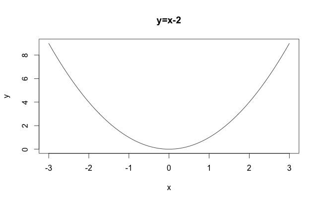

      例題2.22 複数のグラフ  
      RINT222.R
      ```
      curve(sin(x),-2*pi,xlab='x',ylab='y',main='y=sin(x),cos(x)')
      curve(cos(x),-2*pi,2*pi,add=TRUE)
      ```

      実行結果  
      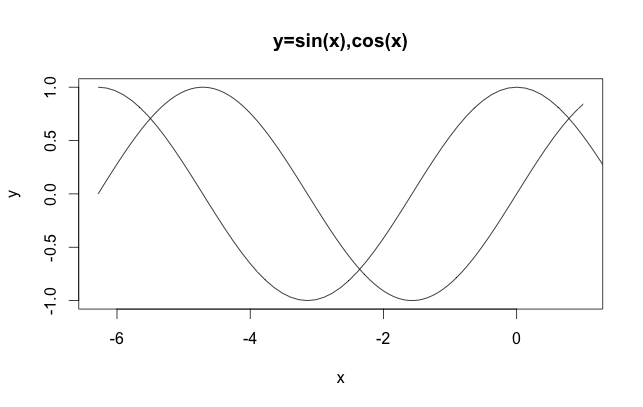

      例題2.23 グラフの保存  
      RINT223.R
      ```
      # pngで保存
      png('img/graph.png')
      curve(x^2,-3,3,main='y=x^2')
      dev.off()
      # epsで保存
      postscript('img/graph.eps',paper='special',width=4,height=4,horizontal=FALSE)
      curve(x^2,-3,3,main='y=x^2')
      dev.off()
      ```

   1. ヒストグラム
      例題2.24 ヒストグラム  
      RINT224.R
      ```
      x = rnorm(1000)
      par(family="HiraMaruProN-W4")
      hist(x,25,xlab='正規乱数値',ylab='度数',main='正規分布図(n=1000)')
      ```
      
      実行結果  
      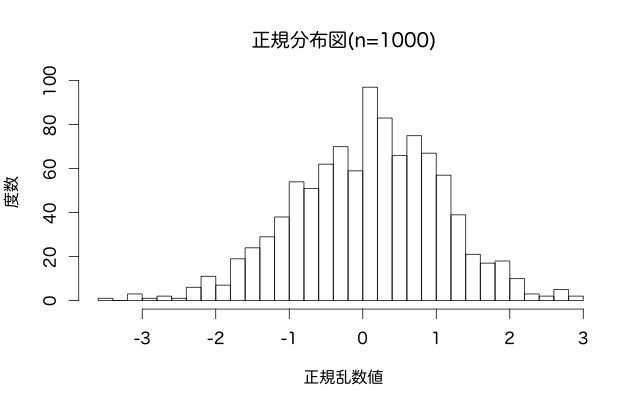

   1. その他グラフ
      例題2.25 対数グラフ  
      RINT225.R
      ```
      # 指数関数的データのプロット
      x=c(1,2,3,4,5)
      y=c(1/2,1/2^2,1/2^3,1/2^4,1/2^5)
      plot(x,y)
      # 片対数グラフ
      plot(x,y,log='y')
      # べき乗関数的データのプロット
      x=c(1,2,3,4,5)
      y=c(1.4,9,16,25)
      plot(x,y)
      # 両対数グラフ
      plot(x,y,log='xy')
      ```
      
      実行結果  
      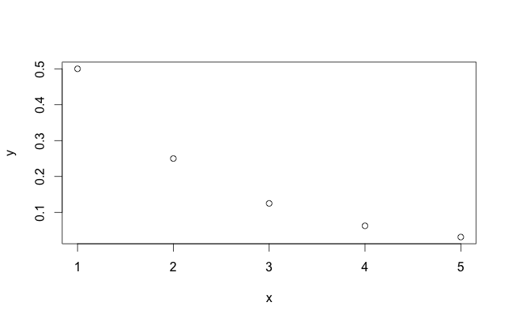
      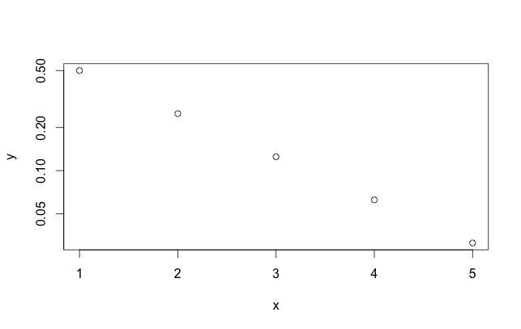
      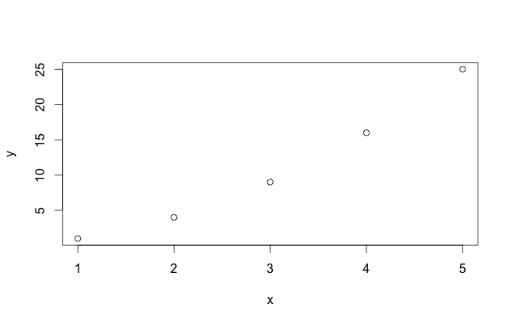
      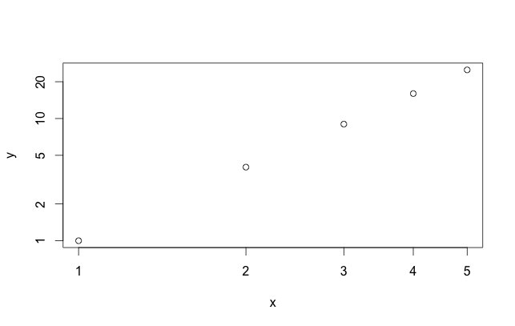            

      例題2.26 グラフの整形
      RINT226.R
      ```
      x = 1:10
      y = sqrt(x)
      par(family="HiraMaruProN-W4")      
      plot(x,y,xlab='x',ylab=expression(sqrt(x)),
        type='l',
        main = ' 平方根のグラフ'
        )
      ```
      
      実行結果  
      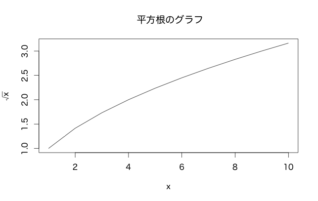

      例題2.27 ボックス・プロット  
      RINT227.R
      ```
      a = c(79.98,80.04,80.02,80.04,80.03,80.03,80.04,79.97,80.05,80.03,80.02,80.00,80.02)
      b = c(80.02,79.94,79.98,79.98,79.97,79.97,80.03,79.95,79.97)
      boxplot(a,b)
      ```
      
      実行結果  
      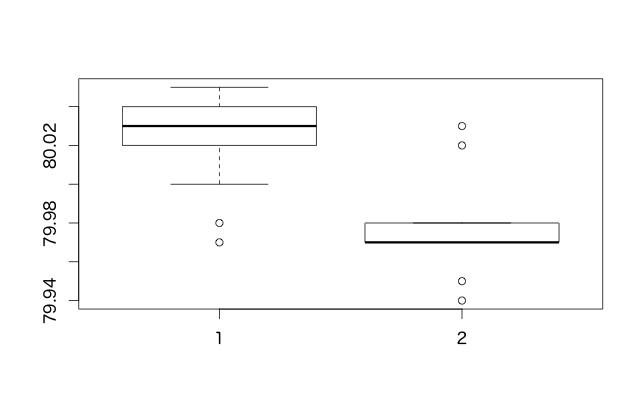

      例題2.28 幹一葉グラフ  
      RINT228.R
      ```
      x = c(18,49,3,5,18,0,27,11,32,22,53,0,7,45,36)
      stem(x,scale=2)
      ```
      実行結果
      ```
      > source("chap2/RINT228.R", echo=TRUE)

      > x = c(18,49,3,5,18,0,27,11,32,22,53,0,7,45,36)

      > stem(x,scale=2)

        The decimal point is 1 digit(s) to the right of the |

        0 | 00357
        1 | 188
        2 | 27
        3 | 26
        4 | 59
        5 | 3      
      ```

      例題2.29 棒グラフ  
      RINT229.R
      ```
      # 縦棒グラフ
      x = c(1,2,3,4,5,6,7,8,9,10)
      y = c(170,185,169,184,177,178,181,170,168,190)
      barplot(y,xlab='nuber',ylab='value',main='barchart',names.arg=x,ylim=c(0,200))
      # 横棒グラフ
      x = c(1,2,3,4,5,6,7,8,9,10)
      y = c(170,185,169,184,177,178,181,170,168,190)
      barplot(y,xlab='value',ylab='number',main='barchart',names.arg=x,xlim=c(0,200),horiz=TRUE)
      ```
      
      実行結果  
      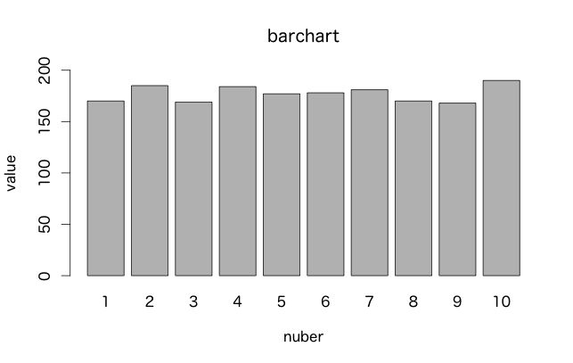
      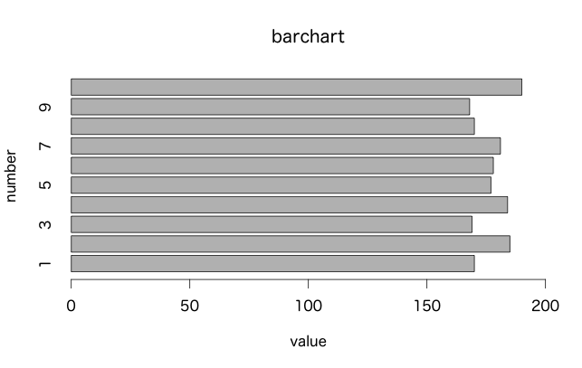      
      
      例題2.30 円グラフ  
      RINT230.R
      ```
      phone = c(47,27,20,2,3)
      names(phone) = c('DoCoMo','au','Softbank','Emobile','Wilcom')
      phone.col = c('red','green','white','yellow','cyan')
      par(family="HiraMaruProN-W4")                  
      pie(phone,radius=0.9,col=phone.col,main=' 携帯電話のシェア')
      ```
      
      実行結果  
      
      
1. プログラミング

   1. プログラム制御

      例題2.31 条件判定  
      RINT231.R
      ```
      a = scan()
      if (a>0) print('a is positive') else print('a is not positive')
      ```
      実行結果
      ```
      > source("chap2/RINT231.R", echo=TRUE)

      > a = scan()
      1: 3
      2: 
      Read 1 item

      > if (a>0) print('a is positive') else print('a is not positive')
      [1] "a is positive"
      > source("chap2/RINT231.R", echo=TRUE)

      > a = scan()
      1: -6
      2: 
      Read 1 item

      > if (a>0) print('a is positive') else print('a is not positive')
      [1] "a is not positive"   
      ```   

      例題2.32 繰り返し(for)  
      RINT232.R
      ```
      n = scan()
      s = 0
      for(i in 1:n)
      {
          s = s + i
       }
       print(s)
      ```
      実行結果
      ```
      > source("chap2/RINT232.R", echo=TRUE)

      > n = scan()
      1: 10
      2: 
      Read 1 item

      > s = 0

      > for(i in 1:n)
      + {
      +     s = s + i
      + }

      > print(s)
      [1] 55    
      ```
    
      例題2.33 繰り返し(while)  
      RINT233.R
      ```
      n = scan()
      s = 0
      i = 0
      while(i <= n)
      {
        s = s+i
        i = i+1
      }
      print(s)
      ```
      実行結果
      ```
      > source("chap2/RINT233.R", echo=TRUE)

      > n = scan()
      1: 10
      2: 
      Read 1 item

      > s = 0

      > i = 0

      > while(i <= n)
      + {
      +     s = s+i
      +     i = i+1
      + }
  
      > print(s)
      [1] 55
      ```
    
   1. 関数
   
      例題2.34 関数  
      RINT234.R
      ```
      # プログラム RINT234.R
      # 1からnまでの整数の和を求める。
      RINT234 = function(n)
          {
              s = 0
              for(i in 1:n)
                  {
                      s = s+i
                  }
              print(s)
          }    
      ```
      実行結果
      ```
      > source("chap2/RINT234.R", echo=TRUE)
      > # プログラム RINT234.R
      > # 1からnまでの整数の和を求める。
      > RINT234 = function(n)
      +     {
      +         s = 0
      +         for(i in 1:n)
      +             {
      +                 s = .... [TRUNCATED] 
      > RINT234(100)
      [1] 5050    
      ```

      例題2.35 再帰呼び出し  
      RINT235.R
      ```
      # プログラム RINT235.R
      # xの階乗を求める。
      fact = function(x)
          {
              ifelse(x==0,1,x*fact(x-1))
          }
      ```
      実行結果
      ```
      > source("chap2/RINT235.R", echo=TRUE)

      > # プログラム RINT235.R
      > # xの階乗を求める。
      > fact = function(x)
      +     {
      +         ifelse(x==0,1,x*fact(x-1))
      +     }
      > fact(10)
      [1] 3628800
      > fact(0)
      [1] 1
      > fact(1)
      [1] 1    
      ```
    
   1. ファイル処理

      例題2.36 ファイル読み込み  
      read.csv  
      ```
      1,2,3,4,5,6,7,8,9,10
      ```      
      RINT236.R
      ```
      x = read.csv("chap2/rint236.txt",header=FALSE,sep=",")
      x
      y = 1:10
      y
      mean(y)      
      ```
      実行結果
      ```
      > source("chap2/RINT236.R", echo=TRUE)

      > x = read.csv("chap2/rint236.txt",header=FALSE,sep=",")

      > x
        V1 V2 V3 V4 V5 V6 V7 V8 V9 V10
      1  1  2  3  4  5  6  7  8  9  10

      > y = 1:10

      > y
       [1]  1  2  3  4  5  6  7  8  9 10

      > mean(y)
      [1] 5.5      
      ```

      例題2.37 ファイルへの書き込み  
      RINT237.R
      ```
      x = c(1,2,3,4,5,6,7,8,9,10)
      write(x,"chap2/output.txt",sep = " ",ncolumns=10)
      write(c("mean(x)=",mean(x)), "chap2/output.txt",append=TRUE)      
      ```
      実行結果
      ```
      >source("chap2/RINT237.R", echo=TRUE)

      > x = c(1,2,3,4,5,6,7,8,9,10)

      > write(x,"chap2/output.txt",sep = " ",ncolumns=10)

      > write(c("mean(x)=",mean(x)), "chap2/output.txt",append=TRUE)
      >       
      ```

      例題2.38 Excelデータの読み込み  
      Rdata.csv
      
      年齢  | 身長 | 体重
      ----- | -----| -----
      20    | 176  | 71
      23    | 181  | 78
      21    | 173  | 80
      19    | 179  | 82


      RINT238.R
      ```
      mydata = read.table("chap2/Rdata.csv",header=TRUE,sep=",")
      mydata
      sprintf("身長平均 = %5.2f", mean(mydata$身長))
      sprintf("体重平均 = %5.2f", mean(mydata$体重))      
      ```
      実行結果
      ```
      > source("chap2/RINT238.R", echo=TRUE)

      > mydata = read.table("chap2/Rdata.csv",header=TRUE,sep=",")

      > mydata
        年齢 身長 体重
      1   20  176   71
      2   23  181   78
      3   21  173   80
      4   19  179   82

      > sprintf("身長平均 = %5.2f", mean(mydata$身長))
      [1] "身長平均 = 177.25"

      > sprintf("体重平均 = %5.2f", mean(mydata$体重))
      [1] "体重平均 = 77.75"      
      ```

      例題2.39 ファイル読み込み  
      RINT239.R
      ```
      mydata2 = data.frame(
          年齢 = c(20,23,21,19),
          身長 = c(176,181,173,179),
          体重 = c(71,78,80,82))
      write.table(mydata2,"chap2/sample.csv",sep=",",row.names=FALSE)
      yy = read.table("chap2/sample.csv",header=TRUE,sep=",")
      yy      
      ```
      実行結果
      ```
      > source("chap2/RINT239.R", echo=TRUE)

      > mydata2 = data.frame(
      +     年齢 = c(20,23,21,19),
      +     身長 = c(176,181,173,179),
      +     体重 = c(71,78,80,82))

      > write.table(mydata2,"chap2/sample.csv",sep=",",row.names=FALSE)

      > yy = read.table("chap2/sample.csv",header=TRUE,sep=",")

      > yy
        年齢 身長 体重
      1   20  176   71
      2   23  181   78
      3   21  173   80
      4   19  179   82      
      ```
      
## <a name="chapter3">確率と統計 ##
1. 確率

   確率(probability)は、ある事象が起こる確からしさを「0」「1」の間の１つの実数値で表したものである。  
   試行(trial)・・・観測や実験。  
   事象(event)・・・試行によって生じる様々な結果の集合。ある事象をAとするとき、Aの起こる確率をP(A)と書くことにする。  

   1. 確率の基礎概念  
      いま、すべての事象の集合を$\Omega$とすると、ある１つの事象Aは$\Omega$の部分集合と考えられる。  
      なお、$\Omega$の部分集合A,B,..について定義される集合を次のように表記する。  
      + $A^{c}$・・・Aの補集合(complement)        
      + ${A}\cup{B}$・・・AとBの結合集合(union)        
      + ${A}\cap{B}$・・・AとBの共通集合(intersection)        
      + $\emptyset$ ・・・空集合(empty set)                
   1. 確率の公理的定義  
      いま、$\Omega$のすべての部分集合の集合(べき集合)をSとすると、確率の公理システムは次の３つの公理からなる。  
      + $(P1)任意の事象A \in Sについて、P(A) \leq １である。$
      + $(P2)事象A \in Sが確実に起こるならば、P(A) = 1である。$
      + $(P3)事象A,B \in Sが互いに排反ならば、P(A \cup B) = P(A) + P(B)である。$
   1. 条件付確率
      事象A,Bについて$P(A) \neq 0$ならば、Aが起こったときのBの条件付確率(conditional probablility)は$P(B \mid A)$と書く。  
      $$
      P(B \mid A) = \frac{P(A \cap B)}{P(A)}
      $$
1. 確率変数と確率分布  

    確率変数(rondom variable)・・・事象を表す変数のこと。  
   
   1. 離散確率変数  
      いま、確率変数の定義域を${a_{1},a_{2},...}$とし、$P(X = a_{i})$が与えられているとき、Xを離散確率変数という。  
      $P(X = a_{i}) = p_{i}$としたとき
      $$
      (a_{i},p_{i})(i = 1,2,...\sum_{i}^{}a_{i}p_{i} = 1)
      $$
      はXの確率分布(probability distribution)という。
      一般に、確率変数に対して、平均値(average),分散(variance)、標準偏差値(standard deviation)の概念を定義できる。  
      + Xの平均値:$E(X) = \sum_{i}^{}a_{i}p_{i}$
      + Xの分散:  $V(X) = E((X-E(X))^{2})$
      + Xの標準編纂: $\sigma X = \sqrt{V(X)}$
   1. 連続確率変数
      連続確率変数は、ある値を取る確率ではなく、取る値がある区間に入る確率を表す。  
      いま、dxを微小な項とし、
      $$
      P(x < X \leq x + dx) = f(x)dx
      $$
      とするとき、Xは連続確率変数といい、f(x)はXの確率密度関数(probability density function)という。  
      よって、次の関係が成り立つ。
      $$
      P(a < X \leq b) = \int_{a}^{b}f(x)dx
      $$
      連続確率変数では、平均値、分散、標準偏差は以下のように定義される。 
      $$E(X) = \int_{- \infty}^{\infty}xf(x)dx$$      
      $$V(X) = \int_{- \infty}^{\infty}(x - E(X))^{2}f(x)dx$$
      $$\sigma x = \sqrt{V(X)}$$
      確率変数Xの取る値が$x_{i}$ であり、x以下である確率を考えると、この関数はxの関数となるが、これを分布関数(distribution function)という。
      $$
      F(x) = P(X \leq x)(- \infty \leq x \leq \infty)
      $$
      連続確率変数の分布関数は、なめらかな関数となる。  
      $$
      P(a < x \leq) = F(b) - F(a) = \int_{a}^{b}f(x)dx
      $$
      離散確率変数の分布関数
      $$
      F(x) = \sum_{xk \leq x}^{}pk
      $$
      
   1. 主な確率分布  
      ある事象Eの起こる確率をpとし、試行を何回も独立に行ったとする。このような試行をn回繰り返したときに、r回Eの起こる確率P(X = r)は
      $$
      P(X = r) = {}_n C_r p^{r}(1 - p)^{n - r}
      $$
      ２項分布は、以下の性質を満足する。  
      $$
      \sum_{r=0}^{n}P(X = r) = \sum_{r=0}^{n} {}_n C_r p^{r}(1 - p)^{n - r} = 1
      $$

      例題3.1 ２項分布  
      RINT301.R
      ```
      x = 0:50
      y = dbinom(x,50,0.25)
      par(family="HiraMaruProN-W4")                  
      plot(x,y,type='h',xlab='x',ylab='y',main=' 二項分布')
      ```

      実行結果  
      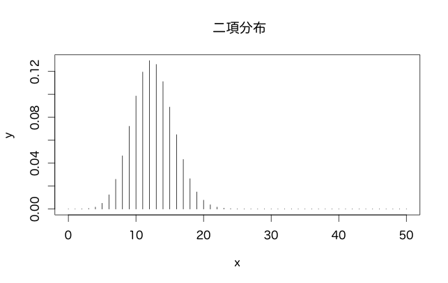
      
      ポアソン分布
      
  $$
  P(X = r) = \frac{ \lambda^{r}}{r!}e^{-\lambda} (\lambda > 0)
  $$

      例題3.2 ポワソン分布  
      RINT302.R
      ```
      x = 0:7
      y = dpois(x,3)
      par(family="HiraMaruProN-W4")                  
      plot(x,y,type='l',xlab='x',ylab='y',main=' ポワソン分布')
      ```
     
      実行結果  
      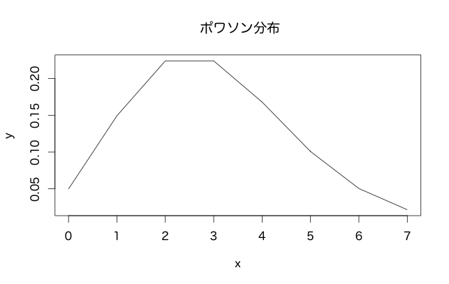

      正規分布

   $$
   f(x) = \frac{1}{\sqrt{2\pi\sigma}}e^{-\frac{(x-\mu^{2})}{2\sigma^{2}}}
   $$
   標準正規分布(standardized normal distribution)
   $$
   f(x) = \frac{1}{\sqrt{2\pi}}e^{-\frac{x^{2}}{2}}
   $$
   
      例題3.3 正規分布  
      RINT303.R
      ```
      x = seq(-5,5,by=0.1)
      y = dnorm(x,0,1)
      par(family="HiraMaruProN-W4")                  
      plot(x,y,type='l',xlab='x',ylab='y',main=' 標準正規分布 N(1,0)')
      ```
     
      実行結果  
      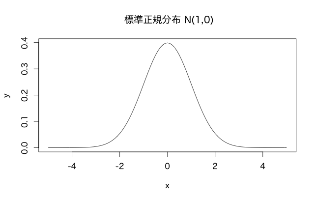

      一様分布

   $$
   f(x) = \frac{1}{b-a} ( x \in [a,b])
   $$
   $$
   f(x) = 0 (x not \in [a,b])
   $$
   
      例題3.4 一様分布  
      RINT304.R
      ```
      x = 0:1
      y = dunif(x,0,1)
      par(family="HiraMaruProN-W4")                  
      plot(x,y,type='l',xlab='x',ylab='y',main=' 一様分布')
      ```
     
      実行結果  
      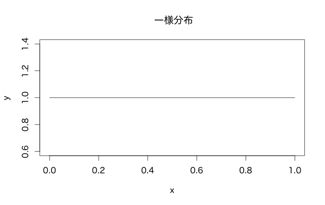

      例題3.5 二項分布の平均値と分散  
      １２個のサイコロを同時に投げて、「５」または「６」の目が出た回数。
      
      回数  |  0   | 1    | 2    | 3   | 4   | 5   | 6   | 7   | 8   | 9   | 10  | 11  | 12  |
      ----- | -----| -----| -----|-----|-----|-----|-----|-----|-----|-----|-----|-----|-----|
      度数  |  185 | 1149 | 3265 | 5475| 6114| 5194| 3067| 1331| 403 | 105 | 18  | 0   | 0   |

      RINT305.R
      ```
      x = c(0,1,2,3,4,5,6,7,8,9,10,11,12)
      x
      y=c(185,1149,3265,5475,6114,5194,3067,1331,403,105,19,0,0)
      y
      n=sum(y)
      heikin=sum(x*y)/n
      heikin
      bunsan=sum((x-heikin)^2*y/n)
      bunsan
      # 実験による結果
      par(family="HiraMaruProN-W4")                  
      plot(y/n~x,xlab="x",ylab="確率(実験)")
      # ２項分布B(12,1/3)
      pp=dbinom(0:12,size=12,prob=1/3)
      pp
      par(family="HiraMaruProN-W4")                  
      plot(pp,xlab="x",ylab="確率")
      ```
     
      実行結果  
      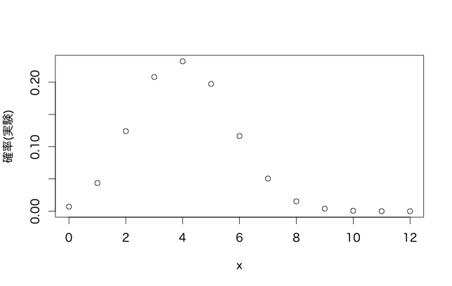
      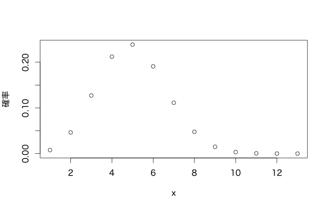

      例題3.6 ポワソン分布の確認  
      ロンドンの南部地区を567個に分けて、それらの地区がV-2により何度爆撃されたかを調べた結果
      
      回数    |  0   | 1    | 2    | 3   | 4   | 5   | 6以上|
      ------- | -----| -----| -----|-----|-----|-----|------|
      地区数  |  229 | 211  | 93   | 35  | 7   | 1   | 0    |

      RINT306.R
      ```
      x = c(0,1,2,3,4,5)
      x
      y = c(229,211,93,35,7,1)
      y
      地区総数 = sum(y)
      地区総数
      平均 = sum(x*y)/地区総数
      平均
      分散 = sum((x-平均)^2*y)/地区総数
      分散
      # データによる結果
      par(family="HiraMaruProN-W4")                  
      plot(y/地区総数~x)
      # ポワソン分布
      pd = dpois(x=0:5,lambda=平均)
      par(family="HiraMaruProN-W4")                  
      plot(pd,xlab='x',ylab='Poison 分布')
      ```
     
      実行結果  
      
      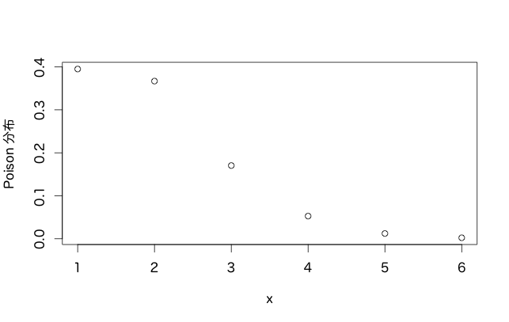

      例題3.7 正規分布の確認  
      標準正規分布の平均(=0)と分散(=1)を正規乱数1000個を用いて確認。      
      
      RINT307.R
      ```
      x = rnorm(10000)
      mean(x)
      sd(x)
      ```
     
      実行結果  
      ```
      > source("chap3/RINT307.R", echo=TRUE)

      > x = rnorm(10000)

      > mean(x)
      [1] -0.008778838

      > sd(x)
      [1] 1.007761      
      ```      

1. 乱数
   1. 乱数の種類
      + 正規乱数(normal random number)・・・正規分布に従う乱数。
      + 一様乱数(uniform random number)・・・ある区間内のすべての実数が同じ確率で出現する乱数。
      + 擬似乱数(pseudo-random number)・・・コンピュータで生成される乱数であり、前の乱数の値から次の乱数の値を計算して乱数を発生させる。     
   1. 乱数の分布
      例題3.8 正規乱数とヒストグラム

      RINT308.R
      ```
      # ヒストグラム(1000個、25分割)
      x = rnorm(1000)
      par(family="HiraMaruProN-W4")                  
      hist(x,25,xlab=' 正規乱数値',ylab=' 度数',main=' 正規分布(n=1000)')
      # ヒストグラム(1000個、30分割)
      x = rnorm(1000)
      par(family="HiraMaruProN-W4")                  
      hist(x,30,xlab=' 正規乱数値',ylab=' 度数',main=' 正規分布(n=1000)')
      # ヒストグラムと近似曲線(1000個、30分割)
      x = rnorm(1000)
      par(family="HiraMaruProN-W4")                  
      hist(x,30,prob=TRUE,xlab=' 正規乱数値',ylab=' 度数',main=' ヒストグラムと近似曲線')
      lines(density(x))      
      ```
     
      実行結果  
      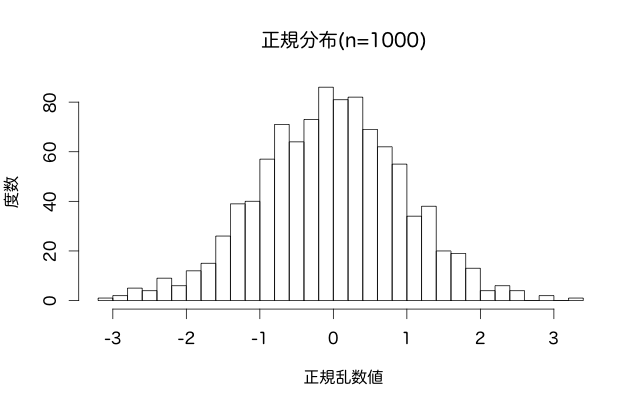
      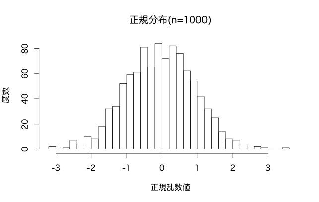
      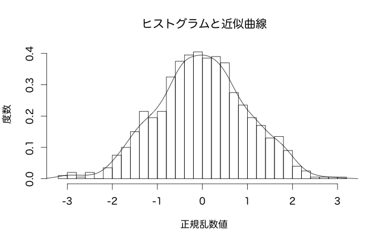

      例題3.9 二項乱数

      RINT309.R
      ```
      pp = rbinom(1000,size=1,p=0.5)
      sum(pp)
      pp = rbinom(1000,size=1,p=0.5)
      sum(pp)
      ```
     
      実行結果  
      ```
      > source("chap3/RINT309.R", echo=TRUE)

      > pp = rbinom(1000,size=1,p=0.5)

      > sum(pp)
      [1] 500

      > pp = rbinom(1000,size=1,p=0.5)

      > sum(pp)
      [1] 485      
      ``` 
      
   1. 乱数の平均と標準偏差

      例題3.10 一様乱数

      RINT310.R
      ```
      set.seed(123)
      x = runif(10)
      x
      mean(x)
      sd(x)
      set.seed(123)
      x = runif(10)
      x
      ```
     
      実行結果  
      ```
      > source("chap3/RINT310.R", echo=TRUE)

      > set.seed(123)

      > x = runif(10)

      > x
       [1] 0.2875775 0.7883051 0.4089769 0.8830174 0.9404673 0.0455565 0.5281055
       [8] 0.8924190 0.5514350 0.4566147

      > mean(x)
      [1] 0.5782475

      > sd(x)
      [1] 0.29474

      > set.seed(123)

      > x = runif(10)

      > x
       [1] 0.2875775 0.7883051 0.4089769 0.8830174 0.9404673 0.0455565 0.5281055
       [8] 0.8924190 0.5514350 0.4566147
      ```

      例題3.11 正規乱数

      RINT311.R
      ```
      options(digits=2)
      nr = rnorm(10)
      nr
      mean(nr)
      sd(nr)

      x = rnorm(1000)
      mean(x)
      sd(x)
      ```
     
      実行結果  
      ```
      > source("chap3/RINT311.R", echo=TRUE)

      > options(digits=2)

      > nr = rnorm(10)

      > nr
       [1]  0.19  0.23 -1.26  0.29  1.75 -0.16 -0.16  1.40  0.90 -1.65

      > mean(nr)
      [1] 0.15

      > sd(nr)
      [1] 1.1

      > x = rnorm(1000)

      > mean(x)
      [1] 0.04

      > sd(x)
      [1] 1
      ```

      例題3.12 正規乱数と正規分布

      RINT312.R
      ```
      x = rnorm(1000)
      qqnorm(x)
      qqline(x)
      ```
     
      実行結果  
      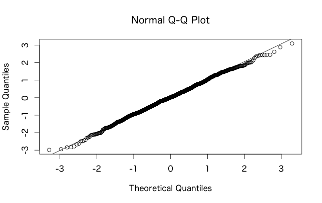

## <a name="chapter4">統計分析 ##
1. 代表値

   代表値・・・平均値、中央値、最頻値、パーセンタイル  
   散布度・・・分散、標準偏差、範囲、四分位偏差、変動係数、尖度、歪度
   
   1. 平均
      算術平均(arithmetic mean)
      $$
      m = \frac{1}{n}\sum_{i=1}^{n}x_{i}
      $$

      例題4.1 平均      
      
      RINT401.R
      ```
      x = c(4,1,-3,5,-2,7,-3.5,-1,4.6)
      n = NROW(x); n
      mean(x)
      ```
     
      実行結果  
      ```
      > source('chap4/RINT401.R', echo=TRUE)

      > x = c(4,1,-3,5,-2,7,-3.5,-1,4.6)

      > n = NROW(x); n
      [1] 9

      > mean(x)
      [1] 1.344444
      ```
   1. 中央値
   
      中央値(median)
      $$
      med = x_{m} \;\;\; (m = (n + 1)/2)
      $$

   $$
   med = x_{m} + x_{m+1}/2  \;\;\; m = n/2
   $$

      例題4.2 中央値
      
      RINT402.R
      ```
      x = c(4,1,-3,5,-2,7,-3.5,-1,4.6)
      median(x)
      y = c(3,1,4,2)
      median(y)
      ```
     
      実行結果  
      ```
      > source('chap4/RINT402.R', echo=TRUE)

      > x = c(4,1,-3,5,-2,7,-3.5,-1,4.6)

      > median(x)
      [1] 1

      > y = c(3,1,4,2)

      > median(y)
      [1] 2.5
      ```         
   1. パーセンタイル

      データを昇順に並べたときの小さい方から数えて全体のある%に位置する値。  
   $$
   p\_perc = (1 - a)d_{m+1} + ad_{m+2}
   $$

      例題4.3 パーセンタイル
      
      RINT403.R
      ```
      quantile(y)
      IQR(y)
      quantile(y,prob=0)
      quantile(y,prob=0.25)
      quantile(y,prob=0.5)
      quantile(y,prob=0.75)
      quantile(y,prob=0.9)
      quantile(y,prob=1.0)
      ```
     
      実行結果  
      ```
      > source('chap4/RINT403.R', echo=TRUE)

      > quantile(y)
        0%  25%  50%  75% 100% 
      1.00 1.75 2.50 3.25 4.00 

      > IQR(y)
      [1] 1.5

      > quantile(y,prob=0)
      0% 
       1 

      > quantile(y,prob=0.25)
       25% 
      1.75 
      
      > quantile(y,prob=0.5)
      50% 
      2.5 

      > quantile(y,prob=0.75)
       75% 
      3.25 

      > quantile(y,prob=0.9)
      90% 
      3.7 

      > quantile(y,prob=1.0)
      100% 
         4 
      ```
      
1. 散布度
   1. 分散
      分散(variance)・・・データのばらつきを表す。
      $$
      s^{2} = \frac{1}{n}\sum_{i=1}^{n}(x_{i}-m)^{2}
      $$
      不偏分散(unbiased variance)・・・$s^{2}$の定義の分母$n$を$n-1$に変えて得られる分散。
      $$
      u^{2} = \frac{1}{n-1}\sum_{i=1}^{n}(x_{i}-m)^{2}
      $$
      偏差平方和(sum of square bias)
      $$
      S = \sum_{i=1}^{n}(x_{i}-m)^{2}
      $$
      偏差(bias)
      $$
      x_{i}-m
      $$
   1. 標準偏差
      標準編纂(standard deviation)・・・分散の平方根。
      $$
      \sigma = \sqrt{V}
      $$
   1. 範囲
      範囲(range)・・・最大値から最小値を引いた値であり、データのばらつきを表す。
      $$
      R = Max - Min
      $$
   1. 変動係数
      変動係数(coeffcient of variation)・・・標準偏差を平均で割った値であり、単位の異なるデータのばらつきを表す。
      $$
      C = \frac{\sigma}{m}
      $$

      例題4.4 散布度
      
      RINT404.R
      ```
      x = c(4,1,-3,5,-2,7,-3.5,-1,4.6)
      n = NROW(x)
      n
      range(x)
      IQR(x)
      IQR(x)/2
      var(x)
      sd(x)
      sum((x-mean(x))^2)/n
      sqrt(sum((x-mean(x))^2)/n)
      C = sd(x)/mean(x)
      C
      ```
     
      実行結果  
      ```
      > source('chap4/RINT404.R', echo=TRUE)

      > x = c(4,1,-3,5,-2,7,-3.5,-1,4.6)

      > n = NROW(x)

      > n
      [1] 9

      > range(x)
      [1] -3.5  7.0

      > IQR(x)
      [1] 6.6

      > IQR(x)/2
      [1] 3.3

      > var(x)
      [1] 15.26778

      > sd(x)
      [1] 3.9074

      > sum((x-mean(x))^2)/n
      [1] 13.57136

      > sqrt(sum((x-mean(x))^2)/n)
      [1] 3.683932

      > C = sd(x)/mean(x)

      > C
      [1] 2.906331
      ```

      例題4.5 5数要約

      下ヒンジ値(lower hinji)・・・最小値と中央値の間の中央値  
      上ヒンジ値(upper hinji)・・・中央値と最大値の間の中央値
      
      RINT405.R
      ```
      y = c(3,1,4,2)
      fivenum(y)
      ```
     
      実行結果  
      ```
      > source('chap4/RINT405.R', echo=TRUE)

      > y = c(3,1,4,2)

      > fivenum(y)
      [1] 1.0 1.5 2.5 3.5 4.0
      ```

      例題4.6 歪度と尖度
      歪度(kurtosis)・・・ゆがみを表す値  
$$
Sk = \frac{n}{(n-1)(n-2)}\frac{1}{u^{3}}\sum_{i=1}^{n}(x_{i}-m)^{3}
$$
      $Sk=0$ならば左右対称であることを意味し、$Sk>0$ならば右に、$Sk<0$左に歪んでいることを意味する。

      尖度(skewness)・・・とがりを表す値
$$
Ku = \frac{n(n+1)}{(n-1)(n-2)(n-3)}\frac{1}{u^{4}}\sum_{i=1}^{n}(x_{i}-m)^{4}-\frac{3(n-1)^{2}}{(n-2)(n-3)}
$$
      $Ku=0$ならば正規分布と同じ形であることを意味し、$Ku>0$ならば正規分布より尖っている、$Ku<0$ならば正規分布より扁平である。

      RINT406.R
      ```
      # 歪度
      x = c(1.89,2.43,2.37,2.3,1.74)
      n = length(x)
      Sk=((n/((n-1)*(n-2)))*sum((x-mean(x))^3))/((sqrt(var(x)))^3)
      Sk
      # 尖度
      Ku=(((n*(n+1))/((n-1)*(n-2)*(n-3)))*sum((x-mean(x))^4))/((sqrt(var(x)))^4) - (3*((n-1)^2))/((n-2)*(n-3))
      Ku
      ```
     
      実行結果  
      ```
      > # 歪度
      > x = c(1.89,2.43,2.37,2.3,1.74)

      > n = length(x)

      > Sk=((n/((n-1)*(n-2)))*sum((x-mean(x))^3))/((sqrt(var(x)))^3)

      > Sk
      [1] -0.6407088

      > # 尖度
      > Ku=(((n*(n+1))/((n-1)*(n-2)*(n-3)))*sum((x-mean(x))^4))/((sqrt(var(x)))^4) - (3*((n-1)^2))/((n-2)*(n-3))

      > Ku
      [1] -2.458639
      ```

1. 相関係数
   1. 相関関係
   1. 相関係数
      相関係数(correlarion coefficient)
      $$
      r = cor(x,y) = \frac{\sum_{}^{}(x_{i}-\overline{x})(y-\overline{y})}{\sqrt{\sum_{}^{}(x_{i}-\overline{x})^2\sum_{}^{}(y_{i}-\overline{y})^2}}
      $$

   $0.8 \leq |r|$:強い相関あり  
   $0.6 \leq |r|<0.8$:相関有り  
   $0.4 \leq |4|<0.6$:弱い相関有り  
   $|r| < 0.4$:相関無し

      例題4.7 相関（１）

            | 軌道長半径 | 質量     | 公転周期
      ----- | -----      | -----    | -----
      水星  | 0.3871     | 0.05527  | 0.24085
      金星  | 0.7233     | 0.815    | 0.61521
      地球  | 1          | 1        | 1
      火星  | 1.5237     | 0.1074   | 1.88089
      木星  | 5.2026     | 317.83   | 11.8622
      土星  | 9.5549     | 95.16    | 29.4578
      天王星  | 19.2184  | 14.54    | 84.0223
      海王星  | 30.1104  | 17.15    | 164.774
      冥王星  | 39.5405  | 0.0023   | 247.796

      RINT407.R
      ```
      length=c(0.3871,0.7233,1,1.5237,5.2026,9.5549,19.2184,30.1104,39.5405)
      mass=c(0.05527,0.815,1,0.1074,317.83,95.16,14.54,17.15,0.0023)
      cor.test(length,mass)
      plot(length,mass)      
      ```
     
      実行結果  
      ```      
      >source('chap4/RINT407.R', echo=TRUE)

      > length=c(0.3871,0.7233,1,1.5237,5.2026,9.5549,19.2184,30.1104,39.5405)

      > mass=c(0.05527,0.815,1,0.1074,317.83,95.16,14.54,17.15,0.0023)

      > cor.test(length,mass)

      	Pearson's product-moment correlation

      data:  length and mass
      t = -0.4313, df = 7, p-value = 0.6792
      alternative hypothesis: true correlation is not equal to 0
      95 percent confidence interval:
       -0.7453655  0.5634400
      sample estimates:
            cor 
      -0.160883 


      > plot(length,mass)      

      ```
      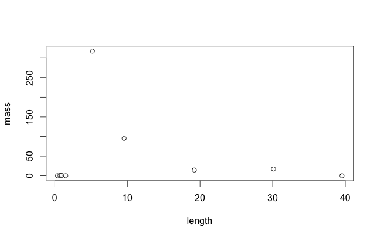

      例題4.8 相関（２）

      体温  | 心拍数
      ----- | -----      
      38.8  | 493.5
      33.0  | 399.0
      39.2  | 485.0
      35.8  | 476.7
      16.8  | 244.4
      12.9  | 199.0
      12.3  | 195.4
       9.4  |  96.2
       8.6  |  77.5
       8.3  |  68.4
       8.1  |  63.4

      RINT408.R
      ```
      temp = c(38.8,33.0,39.2,35.8,16.8,12.9,12.3,9.4,8.6,8.3,8.1)
      count = c(493.5,399.0,485.0,476.7,244.4,199.0,195.4,96.2,77.5,68.4,63.4)
      cor.test(temp,count)
      plot(temp,count)
      ```
     
      実行結果  
      ``` 
      >source('chap4/RINT408.R', echo=TRUE)

      > temp = c(38.8,33.0,39.2,35.8,16.8,12.9,12.3,9.4,8.6,8.3,8.1)

      > count = c(493.5,399.0,485.0,476.7,244.4,199.0,195.4,96.2,77.5,68.4,63.4)

      > cor.test(temp,count)

      	Pearson's product-moment correlation

      data:  temp and count
      t = 17.6374, df = 9, p-value = 2.743e-08
      alternative hypothesis: true correlation is not equal to 0
      95 percent confidence interval:
       0.9445615 0.9964399
      sample estimates:
            cor 
      0.9858406 


      > plot(temp,count)
      ```
      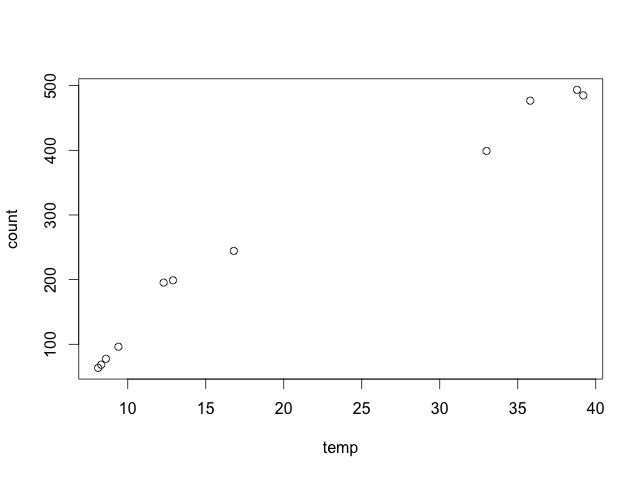      
    
## <a name="chapter5">推定と検定 ##
1. 標本分布

   母集団(population)・・・研究対象となるデータの集団  
       無限母集団(infinite population)  
       有限母集団(finite population)  
       
   母集団のデータを分析するための調査方法  
       全数調査(complete survey)  
       標本調査(sample survey)  

   標本(sample)・・・母集団の一部  
   標本の大きさ(sample size)・・・標本に含まれるデータ数
   
   1. 標本抽出  
      有意抽出(purposive sampling)・・・専門家の判断を加えてから標本を選ぶ方法  
      無作為抽出(rondom sampling)・・・母集団から各データを決まった確率で取り出す方法  
      復元抽出(sampling with replacement)・・・無作為抽出でデータを１つずつ取り出したデータを戻す場合  
      非復元抽出(sampling without replacement)・・・無作為抽出でデータを１つずつ取り出したデータを戻さない場合  
      母平均(population mean)・・・確率変数Xの平均E(X)  
      母分散(population variance)・・・確率変数Xの分散V(X)  
      母数(population parameter)・・・母平均と母分散を合わせたもの  
      
   1. 標本変量  
      標本変量(sample value)・・・大きさnの標本の確率変数の組($X_{1}$...,$X_{n}$)  
      標本平均(sample mean)  
      $$
      \overline{X} = \frac{1}{n}\sum_{i=1}^{n}X_{i}
      $$
      標本分散(sample variance)  
      $$
      S^{2} = \frac{1}{n}\sum_{i=1}^{n}(X_{i}-\overline{X})^{2}
      $$
      統計量(statistical value)・・・標本変量の関数  
      標本分布(sample distribution)・・・統計量の確率分布
      不偏分散(unviased variance)
      $$
      u^{2} = \frac{1}{n-1}\sum_{i=1}^{n}(X_{i}-\overline{X})^{2}
      $$
      標本平均$\overline{X}$の平均と分散
      $$
      E(\overline{X}) = \frac{1}{n}\sum_{i=1}^{n}E(X_{i}) = m
      $$
      $$
      V(\overline{X}) = \frac{1}{n^{2}}\sum_{i=1}^{n}V(X_{i}) = \frac{\sigma^{2}}{n}
      $$
   
1. 推量

   推定(estimation)・・・標本の値から母集団の性質を推定すること
   
   1. 点推定と区間推定  
      点推定(point estimation)・・・未知パラメータの特定の数値を推定する方法  
      区間推定(interval estimation)・・・未知パラメータが取り得る一定の範囲を推定する方法  
      
   1. 母平均の推定  
      例題5.1 母分散が既知である場合の母平均の区間推定
      $$
      \overline{X} = \frac{1.89+2.43+2.37+2.30+1.74}{5} = 2.146
      $$
      $$
      z(\frac{\alpha}{2}) = z(0.025)
      $$
      $$
      z(0.025) = 1.96
      $$
      $$
      z(\frac{\alpha}{2})\frac{\sigma}{\sqrt{n}} = 1.96\frac{0.2}{\sqrt{5}} = 0.1753
      $$
      $$
      T_{1} = \overline{X} - z(\frac{\alpha}{2})\frac{\sigma}{\sqrt{n}} = 2.146 - 0.1753 = 1.9707
      $$
      $$
      T_{2} = \overline{X} + z(\frac{\alpha}{2})\frac{\sigma}{\sqrt{n}} = 2.146 + 0.1753 = 2.3213
      $$      
     
      RINT501.R
      ```
      data = c(1.89,2.43,2.37,2.30,1.74)
      n = 5
      sigma = 0.2
      a = 0.05
      Xb = mean(data)
      Xb
      u = qnorm(1-a/2)
      u
      T1 = Xb-u*sigma/sqrt(n)
      T1
      T2 = Xb+u*sigma/sqrt(n)
      T2      
      ```
     
      実行結果  
      ```
      > source('chap5/RINT501.R', echo=TRUE)

      > data = c(1.89,2.43,2.37,2.30,1.74)

      > n = 5

      > sigma = 0.2

      > a = 0.05

      > Xb = mean(data)

      > Xb
      [1] 2.146

      > u = qnorm(1-a/2)

      > u
      [1] 1.959964

      > T1 = Xb-u*sigma/sqrt(n)

      > T1
      [1] 1.970695

      > T2 = Xb+u*sigma/sqrt(n)

      > T2
      [1] 2.321305      
      ```      
      母分散が未知の場合の母平均区間推定  
  $$
  u^{2} = \frac{1}{n-1}\sum_{i=1}^{n}(X_{i}-\overline{X_{i}})^2
  $$
      $$
      T_{i} = \frac{\overline{X_{i}}-m}{u_{i}/\sqrt{n}}
      $$
      $$
      t=\frac{\overline{X}-m}{u/\sqrt{n}}
      $$
      $$
      f_{\phi}(t) = \frac{\Gamma((\phi+1)/2)}{\Gamma(\phi/2)\sqrt{\pi\phi}}
      $$
      $\phi=n-1$は自由度を表し、$\Gamma$は$\Gamma$関数を表す。

      例題5.2 t分布のグラフ
     
      RINT502.R
      ```
      x = seq(-5,5,by=0.1)
      y = dt(x,1,log=FALSE)
      par(family="HiraMaruProN-W4")                  
      plot(x,y,type='l',xlab='x',ylab='y',main='t 分布')
      ```
     
      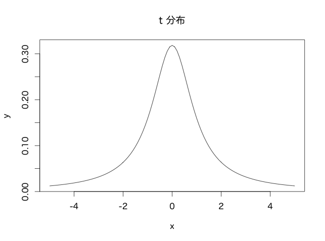      

      例題5.3 母分散が未知である場合の母平均の区間測定  
      ある納品された製品の直径を調べたところ、以下のようなサンプル数16個のデータが得られた。  
      26,33,27,32,33,24,32,29,31,30,27,31,25,34,29,30  
      これより平均は30mmであるといえるか。有意水準を5%として、95%の信頼区間を調べる。  
      自由度$\phi$はn-1=15  

      $$
      \overline{X}=\frac{26+33+...+30}{16}=29.5625
      $$
  $$
  u^{2}=\frac{1}{15}((26-29.5625)^{2}+...+(30-29.5625)^{2}) = 9.195833
  $$
      $$
      u=3.032463
      $$
      $$
      t_{15}(0.025) = 2.13
      $$
      $$
      T_{1} = \overline{X}-t_{n-1}(\frac{\alpha}{2})\frac{u}{\sqrt{n}}=29.5625 - 2.13 \times 9.195833/\sqrt{16} = 27.94661
      $$
      $$
      T_{2} = \overline{X}+t_{n-1}(\frac{\alpha}{2})\frac{u}{\sqrt{n}}=29.5625 + 2.13 \times 9.195833/\sqrt{16} = 31.17839
      $$
     
      RINT503.R
      ```
      rad=c(26,33,27,32,33,24,32,29,31,30,27,31,25,34,29,30)
      n=16
      df=n-1
      a=0.05
      Xb=mean(rad)
      Xb
      t=qt(1-a/2,df)
      t
      u2=(1/(n-1))*sum((rad-Xb)^2)
      T1=Xb-t*sqrt(u2/n)
      T1
      T2=Xb+t*sqrt(u2/n)
      T2
      # t分布に基づく区間推定
      rad=c(26,33,27,32,33,24,32,29,31,30,27,31,25,34,29,30)
      t.test(rad)
      ```
     
      実行結果  
      ```
      > source('chap5/RINT503.R', echo=TRUE)

      > rad=c(26,33,27,32,33,24,32,29,31,30,27,31,25,34,29,30)

      > n=16

      > df=n-1

      > a=0.05

      > Xb=mean(rad)

      > Xb
      [1] 29.5625

      > t=qt(1-a/2,df)

      > t
      [1] 2.13145

      > u2=(1/(n-1))*sum((rad-Xb)^2)

      > T1=Xb-t*sqrt(u2/n)

      > T1
      [1] 27.94661

      > T2=Xb+t*sqrt(u2/n)

      > T2
      [1] 31.17839

      > # t分布に基づく区間推定
      > rad=c(26,33,27,32,33,24,32,29,31,30,27,31,25,34,29,30)

      > t.test(rad)

      	One Sample t-test

      data:  rad
      t = 38.9947, df = 15, p-value < 2.2e-16
      alternative hypothesis: true mean is not equal to 0
      95 percent confidence interval:
       27.94661 31.17839
      sample estimates:
      mean of x 
        29.5625 
      ```      
   1. 母分散の推定
      $x^{2}$(カイ二乗)分布(chi-squared distribution)の確率密度関数  
  $$
  f_{n}(x) = \frac{x^{\frac{n}{2}-1}e^{-\frac{x}{2}}}{2^{\frac{n}{2}}\Gamma(\frac{n}{2})} (x >0)
  $$
      $$
      = 0 (x \leq 0)
      $$

      例題5.4 $x^{2}$分布のグラフ
     
      RINT504.R
      ```
      x = seq(0,30,by=0.1)
      y = dchisq(x,10)
      par(family="HiraMaruProN-W4")                  
      plot(x,y,type='l',xlab='x',ylab='y',main='chi^2 分布')      
      ```
     
      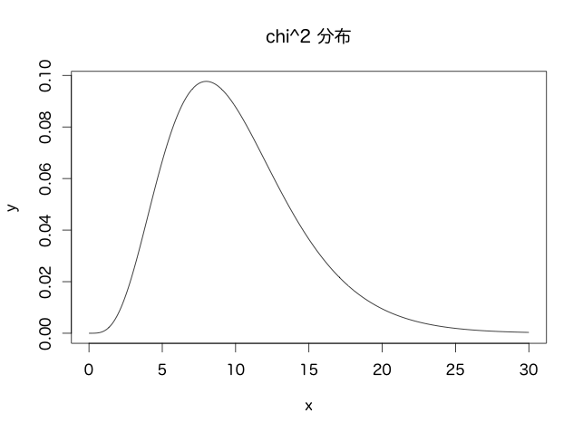      

      例題5.5 母平均が未知の場合の母分散の推定  
      母平均が未知の正規母集団から以下のようなデータが得られたとする。  
      26,33,27,32,33,24,32,29,31,30  
      このとき、母分散$sigma^{2}$の95%信頼区間を求める。  
      $$
      \overline{X} = \frac{26+33+...+30}{10}=29.7
      $$
  $$
  u^{2}=\frac{1}{9}((26-29.7)^{2}+...+(30-29.7)^{2}) = 9.789
  $$
      $$
      x_{0.025}^{2}(9) = 19.02
      $$
      $$
      x_{0.975}^{2}(9) = 2.70
      $$
      $$
      T_{1}=\frac{9\times9.789}{19.02}=4.63
      $$
      $$
      T_{2}=\frac{9\times9.789}{2.70}=32.63
      $$
     
      RINT505.R
      ```
      x=c(26,33,27,32,33,24,32,29,31,30)
      mean(x)
      var(x)
      q1=qchisq(0.025,9,lower.tail=FALSE)
      q1
      q2=qchisq(0.975,9,lower.tail=FALSE)
      q2
      T1=9*var(x)/q1
      T1
      T2=9*var(x)/q2
      T2      
      ```
     
      実行結果  
      ```
      > source('chap5/RINT505.R', echo=TRUE)

      > x=c(26,33,27,32,33,24,32,29,31,30)

      > mean(x)
      [1] 29.7

      > var(x)
      [1] 9.788889

      > q1=qchisq(0.025,9,lower.tail=FALSE)

      > q1
      [1] 19.02277

      > q2=qchisq(0.975,9,lower.tail=FALSE)

      > q2
      [1] 2.700389

      > T1=9*var(x)/q1

      > T1
      [1] 4.631292

      > T2=9*var(x)/q2

      > T2
      [1] 32.62492
      ```      
   1. 母比率の推定  

      例題5.6 母比率の推定  
      東京のある区に住む人に対して、ある調査を1000人に行った。ある項目に対して「賛成」と答えた人は250人いた。よって、25%が賛成といえそうである。  
      別の地区で同様の調査を行うと、賛成は20%になるかもしれない。しかし、40%とか10%になることはないであろう。  
      すなわち、「25」という数字そのものではなく、ある幅を持たせて、「この位の幅(例：22-28%)ならば、この程度(例：90%)の信頼がある」と理解した方がよいであろう。  
      ここで、95%信頼区間で母比率の推定を行うと以下のようになる。  
      $$
      z(0.025)=1.96
      $$
  $$
  T_{1}=0.25-1.96\times\sqrt{0.25\times0.75/1000}=0.2231616
  $$
      $$
      T_{2}=0.25+1.96\times\sqrt{0.25\times0.75/1000}=0.2768384
      $$

      RINT506.R
      ```
      r = 0.25
      n = 1000
      a = 0.05
      u = qnorm(1-a/2)
      u
      T1 = r - u*sqrt(r*(1-r)/n)
      T1
      T2 = r + u*sqrt(r*(1-r)/n)
      T2
      # 母比率の推定
      prop.test(250,1000,0.95)
      # 10000人に対して2500人が「賛成」と答えた場合
      prop.test(2500,10000,0.95)
      ```
     
      実行結果  
      ```
      > source('chap5/RINT506.R', echo=TRUE)

      > r = 0.25

      > n = 1000

      > a = 0.05

      > u = qnorm(1-a/2)

      > u
      [1] 1.959964

      > T1 = r - u*sqrt(r*(1-r)/n)

      > T1
      [1] 0.2231621

      > T2 = r + u*sqrt(r*(1-r)/n)

      > T2
      [1] 0.2768379

      > # 母比率の推定
      > prop.test(250,1000,0.95)

      	1-sample proportions test with continuity correction
      
      data:  250 out of 1000, null probability 0.95
      X-squared = 10301.06, df = 1, p-value < 2.2e-16
      alternative hypothesis: true p is not equal to 0.95
      95 percent confidence interval:
       0.2236728 0.2782761
      sample estimates:
         p 
      0.25 


      > # 10000人に対して2500人が「賛成」と答えた場合
      > prop.test(2500,10000,0.95)

      	1-sample proportions test with continuity correction

      data:  2500 out of 10000, null probability 0.95
      X-squared = 103143.2, df = 1, p-value < 2.2e-16
      alternative hypothesis: true p is not equal to 0.95
      95 percent confidence interval:
       0.2415608 0.2586324
      sample estimates:
         p 
      0.25 
      ```            

1. 検定  
   検定(test)・・・標本の値から母数に違いがあるかどうかを確かめること。
   
   1. 仮説  
      帰無仮説(null hypothesis)・・・対象となる仮説。  
      対立仮説(alternative hypothesis)・・・帰無仮説を棄てる場合に取る仮説。  
      第一種の誤り(error of the first kind)・・・帰無仮説が正しいのに、これを棄てるというもの。  
      第二種の誤り(level of significance)・・・帰無仮説が誤りであるのに、これを採択する誤りである。        
   1. 母平均の検定  

      例題5.7 母分散が既知である場合の母平均の検定

      1.89,2.43,2.37,2.30,1.74  
      母平均を「2.0」と結論してよいかを5%の危険率で検定        
      $$
      Z = \frac{\overline{X} - m}{\sigma/\sqrt{n}}
      $$
      $$
      H_{0}:m=m_{0}
      $$
      $$
      H_{1}:m\neq m_{0}
      $$
      $$
      |\overline{X}-m_{0}|>z(\frac{\alpha}{2})\frac{\sigma}{\sqrt{n}}
      $$
      $$
      H_{0}:m = m_{0} 
      $$
      $$
      H_{1}:m < m_{0}
      $$
      $$
      \overline{X}-m_{0} < -z(\alpha)\frac{\sigma}{\sqrt{n}}
      $$
      $$
      H_{0}:m = 2.0
      $$
      $$
      H_{1}:m \neq 2.0      
      $$
      $$
      \overline{X} = \frac{1.89+2.43+2.37+2.30+1.74}{5} = 2.146
      $$
      $$
      z(\frac{\alpha}{2})\frac{\sigma}{\sqrt{n}} = 1.96\frac{0.2}{\sqrt{5}} = 0.1753
      $$
      $$
      \overline{X} - m = 2.146 - 2.0 = 0.146
      $$
      よって、危険率「0.05」で帰無仮説は棄てられないので、「危険率0.05で母平均を2.0とみなしてもよい」  

      RINT507.R
      ```
      x = c(1.89,2.43,2.37,2.30,1.74)
      n = 5
      sigma = 0.2
      a = 0.05
      m0 = 2.0
      xbar = mean(x)
      xbar
      left = abs(xbar-m0)
      left
      right = qnorm(1-a/2)*sigma/sqrt(n)
      right
      if(left > right) print("m != 2.0") else print("m = 2.0")
      # 両側検定
      x = c(1.89,2.43,2.37,2.30,1.74)
      n = 5
      a = 0.05
      m0 = 2.0
      xbar = mean(x)
      xbar
      sigma = 0.2
      z = abs(xbar-m0)/(0.2/sqrt(n))
      z
      p = pnorm(z,lower.tail=FALSE)*2
      p
      if(p > a) print("m = 2.0") else print("m != 2.0")
      ```
     
      実行結果  
      ```
      > source('chap5/RINT507.R', echo=TRUE)

      > x = c(1.89,2.43,2.37,2.30,1.74)

      > n = 5

      > sigma = 0.2

      > a = 0.05

      > m0 = 2.0

      > xbar = mean(x)

      > xbar
      [1] 2.146

      > left = abs(xbar-m0)

      > left
      [1] 0.146

      > right = qnorm(1-a/2)*sigma/sqrt(n)

      > right
      [1] 0.1753045

      > if(left > right) print("m != 2.0") else print("m = 2.0")
      [1] "m = 2.0"

      > # 両側検定
      > x = c(1.89,2.43,2.37,2.30,1.74)
      
      > n = 5

      > a = 0.05

      > m0 = 2.0

      > xbar = mean(x)

      > xbar
      [1] 2.146

      > sigma = 0.2

      > z = abs(xbar-m0)/(0.2/sqrt(n))

      > z
      [1] 1.63233

      > p = pnorm(z,lower.tail=FALSE)*2

      > p
      [1] 0.1026101

      > if(p > a) print("m = 2.0") else print("m != 2.0")
      [1] "m = 2.0"
      ```

      例題5.8 母分散が未知である場合の母平均の検定  
      26,33,27,32,33,24,32,29,31,30,27,31,25,34,29,30  
      母平均が「33」かどうかを5%の危険率で検定  
      $$
      t = \frac{\overline{X} - m}{u/\sqrt{n}}
      $$
  $$
  \overline{X}=29.5625,u^{2} = 9.195833
  $$
      $$
      H_{0}:m - m_{0}
      $$
      $$
      H_{1}:m \neq m_{0}
      $$
      $$
      |\overline{X} - m_{0}|>t_{\frac{\alpha}{2}}(n - 1)\frac{u}{\sqrt{n}}
      $$
      $$
      H_{0}:m = m_{0}
      $$
      $$
      H_{1}:m < m_{0}
      $$
      $$
      \overline{X} - m_{0} < -t_{\alpha}(n - 1)\frac{u}{\sqrt{n}}
      $$
      $$
      H_{0}:m = m_{0}
      $$
      $$
      H_{1}:m > m_{0}
      $$
      $$
      \overline{X} - m_{0} > t_{\alpha}(n - 1)\frac{u}{\sart{n}}
      $$
      $$
      \overline{X} - m_{0} > t_{\alpha}(n - 1)\frac{u}{\sqrt{n}}
      $$
      $$
      |\overline{X} - m_{0}| = 3.4375
      $$
      $$
      t_{0.025}(15)\frac{u}{\sqrt{16}} = 1.615886      
      $$
      になるので、$H_{1}: m \neq 33$という結論になる。
      
      RINT508.R
      ```
      x = c(26,33,27,32,33,24,32,29,31,30,27,31,25,34,29,30)
      xbar = mean(x)
      xbar
      a = 0.05
      n = 16
      df = n-1
      t = qt(1-a/2,df)
      t
      m0 = 33
      left = abs(xbar-m0)
      u = var(x)
      u
      right = t*sqrt(u/n)
      if(left > right) print("m != 33") else print ("m = 33")

      x = c(26,33,27,32,33,24,32,29,31,30,27,31,25,34,29,30)
      xbar = mean(x)
      xbar
      a = 0.05
      n = 16
      df = n-1
      m0 = 33
      t = abs(xbar-m0)/sqrt(var(x)/16)
      t
      p = pt(t,15,lower.tail = FALSE)*2
      p
      if(p > a) print("m=33") else print("m!=33")

      x = c(26,33,27,32,33,24,32,29,31,30,27,31,25,34,29,30)
      t.test(x,mu=33,alt="two.sided")
      ```
     
      実行結果  
      ```
      > source('chap5/RINT508.R', echo=TRUE)

      > x = c(26,33,27,32,33,24,32,29,31,30,27,31,25,34,29,30)

      > xbar = mean(x)

      > xbar
      [1] 29.5625

      > a = 0.05

      > n = 16

      > df = n-1

      > t = qt(1-a/2,df)

      > t
      [1] 2.13145

      > m0 = 33

      > left = abs(xbar-m0)

      > u = var(x)

      > u
      [1] 9.195833

      > right = t*sqrt(u/n)

      > if(left > right) print("m != 33") else print ("m = 33")
      [1] "m != 33"

      > x = c(26,33,27,32,33,24,32,29,31,30,27,31,25,34,29,30)

      > xbar = mean(x)

      > xbar
      [1] 29.5625
      
      > a = 0.05

      > n = 16

      > df = n-1

      > m0 = 33

      > t = abs(xbar-m0)/sqrt(var(x)/16)

      > t
      [1] 4.534268

      > p = pt(t,15,lower.tail = FALSE)*2

      > p
      [1] 0.0003953759

      > if(p > a) print("m=33") else print("m!=33")
      [1] "m!=33"

      > x = c(26,33,27,32,33,24,32,29,31,30,27,31,25,34,29,30)

      > t.test(x,mu=33,alt="two.sided")

      	One Sample t-test

      data:  x
      t = -4.5343, df = 15, p-value = 0.0003954
      alternative hypothesis: true mean is not equal to 33
      95 percent confidence interval:
       27.94661 31.17839
      sample estimates:
      mean of x 
        29.5625 

      ```                  
   1. 平均値の差の検定  
      例題5.9 対応のある平均値の差の検定  

      番号 | 1   | 2  | 3  | 4  | 5  | 6  | 7  | 8  | 9  | 10  | 11 | 12 |
      ---- | ----|----|----|----|----|----|----|----|--- |---- |----|----|
      4月  | 76  | 57 | 72 | 47 | 52 | 76 | 64 | 64 | 66 | 57  | 38 | 58 |
      7月  | 89  | 60 | 71 | 65 | 60 | 70 | 71 | 69 | 68 | 66  | 50 | 62 |

   $$
   H_{0} : A = B
   $$
      $$
      H_{1} : A < B
      $$
      $$
      t_{0} = \frac{\overline{d}}{\sqrt{u^{2}/n}}
      $$
      $$
      \overline{d} = \frac{-13-3+...-4}{12} = -6.166667
      $$
      $$
      u^{2} = \frac{1}{11}((-13-(-6.166667))^{2} + ... + (-9-(-6.166667))^{2}) = 42.33333
      $$
      $$
      \overline{d} - d_{0} < -t_{0.05}(11)\frac{u}{\sqrt{12}}
      $$
      $$
      -6.166667 - 0 < -1.795885 \times \sqrt{42.33333/12} = -3.373099
      $$
      
      ならば、帰無仮説$H_{0}$は棄却される。よって、H1:A<Bが採択される。  
      また、信頼区間は$-\infty < d_{0} < -2.793568$になる。  
      RINT509.R

      ```
      x = c(76,57,72,47,52,76,64,64,66,57,38,58)
      y = c(89,60,71,65,60,70,71,69,68,66,50,62)
      n = 12
      df = n-1
      m = x-y
      me = mean(m)
      me
      tt = qt(1-0.05,df)
      tt
      left = me-0
      left
      right = -tt*sqrt(var(m)/n)
      right
      if(left<right) print("x < y") else print("x = y")
      print(unlist(list("largest value: ",left-right)))
      # p値による検定
      x = c(76,57,72,47,52,76,64,64,66,57,38,58)
      y = c(89,60,71,65,60,70,71,69,68,66,50,62)
      m = x-y
      me = mean(m)
      me
      t = me/sqrt(var(m)/12)
      t
      p = pt(t,11)
      p
      if(p < 0.05) print("mean(x) < mean(y)") else print("mean(y) = mean(y)")
      # 対応のある平均値の差の検定
      x = c(76,57,72,47,52,76,64,64,66,57,38,58)
      y = c(89,60,71,65,60,70,71,69,68,66,50,62)
      t.test(x,y,alternative="less",paired=T)
      ```
     
      実行結果  
      ```
      > source('chap5/RINT509.R', echo=TRUE)

      > x = c(76,57,72,47,52,76,64,64,66,57,38,58)

      > y = c(89,60,71,65,60,70,71,69,68,66,50,62)

      > n = 12

      > df = n-1

      > m = x-y

      > me = mean(m)

      > me
      [1] -6.166667

      > tt = qt(1-0.05,df)

      > tt
      [1] 1.795885

      > left = me-0

      > left
      [1] -6.166667

      > right = -tt*sqrt(var(m)/n)

      > right
      [1] -3.373099

      > if(left<right) print("x < y") else print("x = y")
      [1] "x < y"

      > print(unlist(list("largest value: ",left-right)))
      [1] "largest value: "   "-2.79356765545161"

      > # p値による検定
      > x = c(76,57,72,47,52,76,64,64,66,57,38,58)

      > y = c(89,60,71,65,60,70,71,69,68,66,50,62)

      > m = x-y

      > me = mean(m)

      > me
      [1] -6.166667

      > t = me/sqrt(var(m)/12)

      > t
      [1] -3.283219

      > p = pt(t,11)

      > p
      [1] 0.003645989

      > if(p < 0.05) print("mean(x) < mean(y)") else print("mean(y) = mean(y)")
      [1] "mean(x) < mean(y)"

      > # 対応のある平均値の差の検定
      > x = c(76,57,72,47,52,76,64,64,66,57,38,58)
      
      > y = c(89,60,71,65,60,70,71,69,68,66,50,62)

      > t.test(x,y,alternative="less",paired=T)

      	Paired t-test

      data:  x and y
      t = -3.2832, df = 11, p-value = 0.003646
      alternative hypothesis: true difference in means is less than 0
      95 percent confidence interval:
            -Inf -2.793568
      sample estimates:
      mean of the differences 
                    -6.166667 
      ```                  
   1. 母分散の検定  
      例題5.10 母平均が未知であるときの母分散の検定  
      $N(m,\sigma^{2})$の正規母集団から、大きさ「15」の標本を抽出したとき、不偏分散が「1.9」であったとする。ここで、母分散$\sigma^{2}$が「1.0」かどうかを5%の危険率で検定。  
      帰無仮説$H_{0}$と対立仮説$H_{1}$は$\sigma_{0}^{2}=1.0$とする。  
      $$
      H_{0}:\sigma^{2} = \sigma_{0}^{2}
      $$
      $$
      H_{1}:\sigma^{2} \neq \sigma_{0}^{2}
      $$
      $$
      x^{2} = \sigma_{i=1}^{n}(\frac{X_{i}-\overline{X}}{\sigma})^{2} = \frac{(n-1)u^{2}}{\sigma^{2}}
      $$
      $$
      x^{2} \leq x_{1-\frac{\alpha}{2}}^{2}(n - 1)またはx^{2} \geq x_{\frac{\alpha}{2}}^{2}(n - 1)
      $$
      $$
      (\frac{(n-1)u^{2}}{x_{\frac{\alpha}{2}}^{2}(n-1)},\frac{(n-1)u^{2}}{x_{1-\frac{\alpha}{2}}^{2}(n-1)})
      $$
      $$
      x^{2}=\frac{(n-1)u^{2}}{\sigma^{2}}=(15-1)\times\frac{1.9}{1} = 26.6
      $$
      $$
      x_{0.025}^{2}(14) = 26.1189
      $$
      $$
      x_{0.975}^{2}(14) = 5.6287
      $$
      棄却域は「26.1189」以上または「5.6287」以下になる。  
      したがって、$H_{0}は棄却されるので、  
      「危険率0.05で母分散を1.0と見なすことはできない」

      RINT510.R
      ```
      n = 15
      a = 0.05
      u2 = 1.9
      q1 = qchisq(0.025,14,lower.tail=FALSE)
      q1
      q2 = qchisq(0.975,14,lower.tail=FALSE)
      q2
      q = (n-1)*u2/1.0
      q
      if(q <= q1 | q2 <= q) print("sigma^2 != 1") else print("sigma^2 = 1")      
      ```
     
      実行結果  
      ```
      > source('chap5/RINT510.R', echo=TRUE)

      > n = 15

      > a = 0.05

      > u2 = 1.9

      > q1 = qchisq(0.025,14,lower.tail=FALSE)

      > q1
      [1] 26.11895

      > q2 = qchisq(0.975,14,lower.tail=FALSE)

      > q2
      [1] 5.628726

      > q = (n-1)*u2/1.0

      > q
      [1] 26.6

      > if(q <= q1 | q2 <= q) print("sigma^2 != 1") else print("sigma^2 = 1")
      [1] "sigma^2 != 1"
      ```
      
   1. 分散の差の検定
      分散の差の検定は、２つの母集団の分散が等しいかを決めるもので、等分散の検定ともいう。

      例題5.11 F分布のグラフ

      RINT511.R
      ```
      x = seq(0,6,by=0.1)
      y = df(x,10,20)
      par(family="HiraMaruProN-W4")                  
      plot(x,y,type='l',xlab='x',ylab='y',main='F 分布')
      ```
     
      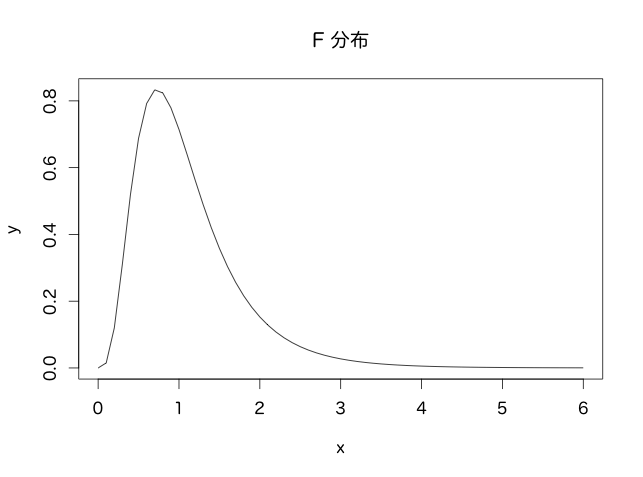      

      例題5.12 分散の差の検定  
      ある工場の２つの製品A,Bの長さのばらつきが等しいかどうかを、それぞれ大きさ「10」の標本データから危険率10%で検定。  
      A:7.0,6.1,5.8,6.1,6.0,5.8,6.4,6.1,5.9,5.8  
      B:6.1,5.9,5.7,5.8,5.9,5.6,5.6,5.9,5.6,5.7  
  $$
  \overline{A} = \frac{7.0+6.1+...+5.8}{10} = 6.1
  $$
      $$
      \overline{B} = \frac{6.1+5.9+...+5.7}{10} = 5.78
      $$
      $$
      u_{A}^{2} = \frac{(7.0-6.1)^{2}+...+(5.8-6.1)^{2}}{9} = 0.1355556
      $$
      $$
      u_{B}^{2} = \frac{(6.1-5.78)^{2}+...+(5.8-6.1)^{2}}{9}=0.1355556
      $$
      $$
      \frac{u_{A}^{2}}{u_{B}^{2}} = 4.765625
      $$
      になるので、危険率10%で$H_{0}$を棄却する。  
      「Aの分散$\sigma_{A}^{2}$とBの分散$\sigma_{B}^{2}は等しくない」  
      信頼区間は
      $$
      T_{1} = \frac{1}{F_{9}^{9}(0.95)} \times \frac{\sigma_{A}^{2}}{\sigma_{B}^{2}} = 0.3145749 \times 4.765625 = 1.499146
      $$
      $$
      T_{2} = \frac{1}{F_{9}^{9}(0.95)} \times \frac{\sigma_{A}^{2}}{\sigma_{B}^{2}} = 3.178893 \times 4.765625 = 15.14941
      $$        

      RINT512.R
      ```
      x = c(7.0,6.1,5.8,6.1,6.0,5.8,6.4,6.1,5.9,5.8)
      y = c(6.1,5.9,5.7,5.8,5.9,5.6,5.6,5.9,5.6,5.7)
      var(x)
      var(y)
      v = var(x)/var(y)
      v
      F1 = qf(0.95,9,9,lower.tail=FALSE)
      F2 = qf(0.05,9,9,lower.tail=FALSE)
      if(v > F2) print("sigma_x^2!=sigma_y^2") else print("sigma_x^2!=sigma_y^2")
      T1 = v/F2
      T2 = v/F1
      T1
      T2
      # var.testの場合
      x = c(7.0,6.1,5.8,6.1,6.0,5.8,6.4,6.1,5.9,5.8)
      y = c(6.1,5.9,5.7,5.8,5.9,5.6,5.6,5.9,5.6,5.7)
      var.test(x,y,alternative="two.sided",conf.level=0.9)      
      ```
     
      実行結果  
      ```
      > source('chap5/RINT512.R', echo=TRUE)

      > x = c(7.0,6.1,5.8,6.1,6.0,5.8,6.4,6.1,5.9,5.8)

      > y = c(6.1,5.9,5.7,5.8,5.9,5.6,5.6,5.9,5.6,5.7)

      > var(x)
      [1] 0.1355556

      > var(y)
      [1] 0.02844444

      > v = var(x)/var(y)

      > v
      [1] 4.765625

      > F1 = qf(0.95,9,9,lower.tail=FALSE)

      > F2 = qf(0.05,9,9,lower.tail=FALSE)

      > if(v > F2) print("sigma_x^2!=sigma_y^2") else print("sigma_x^2!=sigma_y^2")
      [1] "sigma_x^2!=sigma_y^2"

      > T1 = v/F2

      > T2 = v/F1

      > T1
      [1] 1.499146

      > T2
      [1] 15.14941

      > # var.testの場合
      > x = c(7.0,6.1,5.8,6.1,6.0,5.8,6.4,6.1,5.9,5.8)

      > y = c(6.1,5.9,5.7,5.8,5.9,5.6,5.6,5.9,5.6,5.7)

      > var.test(x,y,alternative="two.sided",conf.level=0.9)

      	F test to compare two variances

      data:  x and y
      F = 4.7656, num df = 9, denom df = 9, p-value = 0.02934
      alternative hypothesis: true ratio of variances is not equal to 1
      90 percent confidence interval:
        1.499146 15.149412
      sample estimates:
      ratio of variances 
                4.765625       
      ```                  

## <a name="chapter6">単回帰分析 ##
1. 線回帰モデル  
   回帰分析(regression analysis)・・・ある変量の値から別の変量の値を予測する分析法。
   1. 回帰分析  
      単回帰分析(linear regression analysis)・・・変数Xと変数Yの関係を直線にあてはめ予測を行う分析法。  
      多項式回帰分析(polynomial regression analysis)・・・関係を曲線に当てはめる分析法。  
      重回帰分析(multiple regression)・・・複数の変数からある変数の予測を行う分析法。
   1. 線形回帰モデルの定義
   $$
   Y_{i} = f(X_{i}) + \epsilon_{i}
   $$
   $$
   Y_{i} = \alpha + \beta X_{i} + \epsilon_{i}
   $$
   Yは従属変数(dependent variable)  
   Xは独立変数(independent variable)  
   $\epsilon$は撹乱項(disturbance term)  
   線形回帰モデルでは、一般に以下のような条件が仮定されている。  
   1. 撹乱は確率変数であり、その期待値は「０」である。すなわち、$E(\epsilon_{i}) = 0$である。
   1. 撹乱の分散は一定である。すなわち、すべてのiについて$V(\epsilon_{i}) = \sigma^{2}$である。
   1. 異なる撹乱は無相関である（関連性がない）。すなわち、すべての$i \leq j$について$E(\epsilon_{i}\epsilon_{j}) = 0$である。
   1. $\epsilon_{i}$は正規分布に従う。
   1. $X_{i}$は有限値を持つ非確率変数である。
1. 最小二乗法
   最小二乗法(ordinary least square:OLS)・・・観測値と理論値の差である「残差」の平方和を最小にすることによって、回帰直線を推定する方法。
   1. 最小二乗法の原理
      $$
      (1) E(Y_{i}) = \alpha + \beta X_{i}
      $$
      $$
      (2) L = \sum_{i=1}^{n}(Y_{i} - E(Y_{i}))^{2} = \sum_{i=1}^{n}(Y_{i} - \alpha - \beta X)^{2}
      $$
      $$
      (3) \frac{\partial L}{\partial \alpha} = -2\sum_{i_{1}}^{n}(Y_{i} - \alpha - \beta X_{i})
      $$
      $$
      (4) \sum_{i=1}^{n}Y_{i} = n\alpha + \beta \sum_{i=1}^{n}X_{i}
      $$
      $$
          \sum_{i=1}^{n}X_{i}Y_{i} = \alpha \sum_{i=1}^{n} + \beta \sum_{i=1}^{n}X_{i}^{2}      
      $$
      $$
      (5) \widehat\beta = \frac{n(\sum_{i=1}^{n}X_{i}Y_{i}}{n(\sum_{i=1}^{n}X_{i}^{2})} - (\sum_{i=1}^{n}X_{i})^{2}
      $$
      $$
      (6) \widehat\alpha = \overline Y - \widehat \beta \overline X
      $$
      
   1. 回帰直線
      $$
      S(a,b) = \frac{1}{N}\sum_{i=1}^{n}(y_{i} - (\alpha x_{i} + b))^{2}
      $$
      $$
      \frac{\partial S}{\partial \alpha} = 0
      $$
      $$
      \frac{\partial S}{\partial b} = 0
      $$
      $$
      a \sum_{i=1}^{n} x_{i}^{2} + b \sum_{i=1}^{n} x_{i} = \sum_{i=1}^{n} x_{i} y_{i}
      $$
      $$
      a \sum_{i=1}^{n} x_{i} + bn = \sum_{i=1}{n} y_{i}
      $$
      $$
      a = r(x,y) \frac{\sigma(y)}{\sigma(x)'}
      $$
      $$
      b = \overline y - a \overline x
      $$
      $$
      y = \overline y + r(x,y) \frac{\sigma(y)}{\sigma{x}}(x - \overline x)
      $$
      $$
      \sum_{i=1}^{n}(x_{i} - (cy_{i} + d))^{2}
      $$
      $$
      x = \overline x + r(x,y) \frac{\sigma(x)}{\sigma(y)}(y - \overline y)
      $$

      例題6.1 エンゲル関数  
      $$
      Y = \alpha + \beta X + \epsilon
      $$

      階級(i)  | 消費支出($X_{i}$) | 食料費支出($Y_{i}$)
      -----    | -----             | -----      
      1        | 167,122           | 45,455
      2        | 193,906           | 51,746
      3        | 206,285           | 53,946
      4        | 223,759           | 57,682
      5        | 241,877           | 60,208
      6        | 256,234           | 61,959
      7        | 268,738           | 64,360
      8        | 277,420           | 66,665
      9        | 301,653           | 69,718
      10       | 307,608           | 71,255
      11       | 317,856           | 74,254
      12       | 331,535           | 77,261
      13       | 349,513           | 78,143
      14       | 371,279           | 82,453
      15       | 400,071           | 84,875
      16       | 447,842           | 90,296
      17       | 493,857           | 98,241
      18       | 529,823           | 102,131
      19       | 577,938           | 110,650    
     
      RINT601.R
      ```
      x = c(167122,193906,206285,223759,241877,256234,268738,277420,301653,307608,317856,331535,349513,371279,400071,447842,493857,529823,577938)
      y = c(45455,51746,53946,57682,60208,61959,64360,66665,69718,71255,74254,77261,78143,82453,84875,90296,98241,102131,110650)
      plot(y~x)
      ans1 = lm(y~x)
      print(ans1)
      abline(ans1)      
      ```
     
      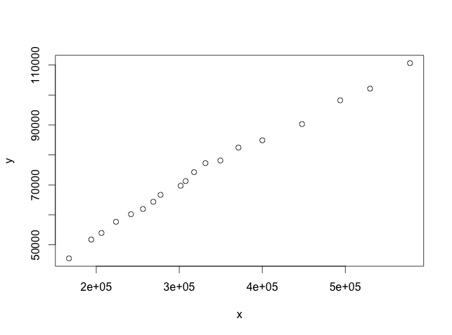
      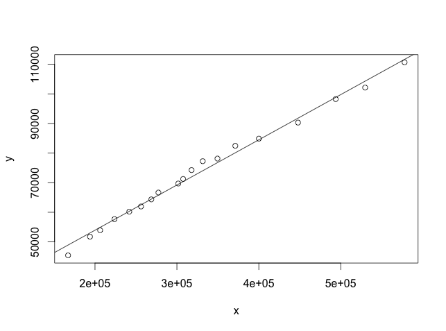      

      例題6.2 多項式回帰分析
     
      RINT602.R
      ```
      x = c(167122,193906,206285,223759,241877,256234,268738,277420,301653,307608,317856,331535,349513,371279,400071,447842,493857,529823,577938)
      y = c(45455,51746,53946,57682,60208,61959,64360,66665,69718,71255,74254,77261,78143,82453,84875,90296,98241,102131,110650)
      plot(y~x)
      ans2 = lm(y~x+I(x^2))
      print(ans2)
      lines(x,fitted(ans2))
      ```
     
      

1. 単回帰分析の評価
   1. 決定係数
   $$
   Y_{i} = \widehat \alpha + \widehat \beta X_{i} + \epsilon_{i} = \widehat Y_{i} + e_{i}
   $$
   $$
   Y_{i} - \overline Y = \widehat Y_{i} - \overline Y + e_{i}
   $$
   $$
   \sum_{i=1}^{n}(Y_{i} - \overline Y)^{2} = \sum_{i=1}^{n}(\widehat Y_{i} - \overline Y)^{2} + 2\sum_{i=1}^{n}(\widehat Y_{i} - \overline Y)e_{i} + \sum_{i=1}^{n}e_{i}^{2}   
   $$
   $$
   = \sum_{i=1}^{n}(\widehat Y_{i} - \overline Y)^{2} + \sum_{i=1}^{n}e_{i}^{2}
   $$
   決定係数$R^{2}$
   $$
   R^{2} = \frac{回帰変動}{総変動} = \frac{\sum_{i=1}^{n}(\widehat Y_{i} - \overline Y)^{2}}{\sum_{i=1}^{n}(Y_{i}-\overline Y)^{2}}
   $$
   1. 調整済み決定係数   
   $$
   R^{2} = 1 - \frac{\sum_{i=1}^{n}e_{i}^{2}/(n-k-1)}{\sum_{i=1}^{n}(Y_{i}-\overline Y)^{2}/(n-1)}
   $$
   例題6.3 回帰分析の詳細結果
     
   RINT603.R
   ```
   x = c(167122,193906,206285,223759,241877,256234,268738,277420,301653,307608,317856,331535,349513,371279,400071,447842,493857,529823,577938)
   y = c(45455,51746,53946,57682,60208,61959,64360,66665,69718,71255,74254,77261,78143,82453,84875,90296,98241,102131,110650)
   ans3 = lm(y~x)
   summary(ans3)
   ```
     
   実行結果  
   ```
   source('chap6/RINT603.R', echo=TRUE)

   > x = c(167122,193906,206285,223759,241877,256234,268738,277420,301653,307608,317856,331535,349513,371279,400071,447842,493857,529823,577938)

   > y = c(45455,51746,53946,57682,60208,61959,64360,66665,69718,71255,74254,77261,78143,82453,84875,90296,98241,102131,110650)

   > ans3 = lm(y~x)

   > summary(ans3)

   Call:
   lm(formula = y ~ x)

   Residuals:
       Min      1Q  Median      3Q     Max 
   -3470.6  -985.1   -83.1   886.2  3228.4 

   Coefficients:
                Estimate Std. Error t value Pr(>|t|)    
   (Intercept) 2.340e+04  1.193e+03   19.61 4.11e-13 ***
   x           1.527e-01  3.424e-03   44.60  < 2e-16 ***
   ---
   Signif. codes:  0 ‘***’ 0.001 ‘**’ 0.01 ‘*’ 0.05 ‘.’ 0.1 ‘ ’ 1

   Residual standard error: 1684 on 17 degrees of freedom
   Multiple R-squared:  0.9915,	Adjusted R-squared:  0.991 
   F-statistic:  1989 on 1 and 17 DF,  p-value: < 2.2e-16

   > 
   ```         

## <a name="chapter7">重回帰分析 ##
1. 多変量回帰モデル
   1. 重回帰分析
   1. 多変量回帰モデルの定義
   $$
   (1) Y_{i} = \beta_{0} + \beta_{1}X_{1i} + ... + + \beta_{k}X_{ki} + \epsilon_{i}
   $$
   $$
   (2) Y = X\beta + \epsilon
   $$
   行列X,Yは以下のように定義される。
   $$
   X = \begin{pmatrix} 1 & X_{11} & ... & X_{k1} \\ 1 & X_{12} & ... & X_{k2} \\ . & . & . \\ . & . & . \\ 1 & X_{1n} & ... & X_{kn} \end{pmatrix}
   ,
   Y = \begin{pmatrix} Y_{1} \\ Y_{2} \\ . \\ . \\ Y_{n}\end{pmatrix}
   $$
   $$
   \beta = \begin{pmatrix} \beta_{0} \\ \beta_{1} \\ . \\ . \\ \beta_{k}\end{pmatrix}
   ,
   \epsilon = \begin{pmatrix} \epsilon_{1} \\ \epsilon_{2} \\ . \\ . \\ \epsilon_{n} \end{pmatrix}
   $$
   多変量回帰モデルでは、一般に、以下のような条件が仮定されている。  
   (1) $\epsilonはN(0,\sigma^{2}E)$に従う。  
   (2) Xは$n\times(k+1)$の比較率的な定数行列である。  
   (3) $n>k+1$  
   (4) $rank(K) = k + 1$  
   多次元正規分布(multivariate normal distribution)
   $$
   f(u_{1},...,u_{n}) = \frac{1}{(2\pi)^{\frac{n}{2}}\sqrt{|\sum|}}exp(-\frac{1}{2}\sum_{i=1}^{n}\sum_{j=1}^{n}\sigma^{ij}(u_{i}-\mu_{i})(u_{j}-\mu_{j}))
   $$
   $$
   f(U) = \frac{1}{(2\pi)^{\frac{n}{2}}}exp(-\frac{1}{2}(U-\mu)'\sigma^{-1}(U - \mu)')
   $$
   $$
   (3) E(Y_{i}) = \beta_{0} + \beta_{1}X_{1i} + ... + \beta_{k}X_{ki}
   $$
   $$
   (4) E(Y) = X\beta
   $$
   ただし
   $$
   E(Y) = \begin{pmatrix} E(Y_{1}) \\ E(Y_{2}) \\ . \\ . \\ E(Y_{n}) \end{pmatrix}
   $$
1. 最小二乗法の一般化
   1. 最小二乗法の行列表示
   $$
   (5) L = \sum_{i=1}^{n}(Y_{i} - \beta_{0} - \beta_{1}X_{1i} - \beta_{k}X_{ki})^{2}
   $$
   $$
   (6) L = (Y - X\beta)'(Y - X\beta)
   $$
   $$
   (7) \frac{\partial L}{\partial \beta_{0}} = -2 \sum_{i=1}^{n}(Y_{i} - \beta_{0} - \beta_{1}X_{1i} - ... - \beta_{k}X_{ki}) = 0
   $$
   $$
   \frac{\partial L}{\partial \beta_{1}} = -2 \sum_{i=1}^{n}X_{1i}(Y_{i} - \beta_{0} - \beta_{1}X_{1i} - ... - \beta X_{ki}) = 0
   $$
   $$
   \frac{\partial L}{\partial \beta_{k}} = -2 \sum_{i=1}^{n}X_{ki}(Y_{i} - \beta_{0} - \beta_{1}X_{1i} - ... - \beta_{k}X_{ki}) = 0
   $$
   1. 最小二乗推定量
   $$
   (8) \sum_{i=1}^{n} = n\widehat\beta_{0} + \beta_{1}\sum_{i=1}^{n}X_{1i} + ... + \widehat\beta_{k}\sum_{i=1}^{n}X_{k}
   $$
   $$
   \sum_{i=1}^{n}X_{1}Y_{i} = \widehat\beta\sum_{i=1}^{n}X_{1i} + \widehat\beta_{1}\sum_{i=1}^{n}X_{1i}^{2} + ... + \beta_{k}\sum_{i=1}^{n}X_{1i}X_{ki}
   $$
   $$
   \sum_{i=1}^{n}X_{ki}Y_{i} = \widehat\beta_{0}\sum_{i=1}^{n}X_{ki}+\widehat\beta_{1}^{n}X_{1i}X_{ki}+ ... + \widehat\beta_{k}\sum_{i=1}^{n}X_{ki}^{2}
   $$
   $$
   (9) X'Y = (X'X)\widehat\beta
   $$
   $$
   (10) \widehat\beta = (X'X)^{-1}X'Y
   $$
   なお、残差eは以下のようになる。
   $$
   e = Y - X\widehat\beta
   $$
   $$
   e'X = 0   
   $$
   $$
   e'\widehat Y = 0'
   $$
   $$
   \widehat Y = X\widehat\beta
   $$

    例題7.1 エンゲル関数(2)  
    $$
    Y = \alpha + \beta X + \epsilon
    $$

      階級(i)  | 消費支出($X_{i}$) | 食料費支出($Y_{i}$) | 住居費($Z_{i}$)
      -----    | -----             | -----               | -----      
      1        | 167,122           | 45,455              | 16,281
      2        | 193,906           | 51,746              | 16,723
      3        | 206,285           | 53,946              | 17,921
      4        | 223,759           | 57,682              | 18,471
      5        | 241,877           | 60,208              | 20,985
      6        | 256,234           | 61,959              | 20,756
      7        | 268,738           | 64,360              | 20,672
      8        | 277,420           | 66,665              | 19,791
      9        | 301,653           | 69,718              | 20,394
      10       | 307,608           | 71,255              | 19,487
      11       | 317,856           | 74,254              | 16,307
      12       | 331,535           | 77,261              | 17,070
      13       | 349,513           | 78,143              | 16,971
      14       | 371,279           | 82,453              | 16,792
      15       | 400,071           | 84,875              | 19,123
      16       | 447,842           | 90,296              | 18,461
      17       | 493,857           | 98,241              | 21,016
      18       | 529,823           | 102,131             | 19,518
      19       | 577,938           | 110,650             | 23,929
     
     RINT701.R
     ```
     x = c(167122,193906,206285,223759,241877,256234,268738,277420,301653,307608,317856,331535,349513,371279,400071,447842,493857,529823,577938)
     y = c(45455,51746,53946,57682,60208,61959,64360,66665,69718,71255,74254,77261,78143,82453,84875,90296,98241,102131,110650)
     z = c(16281,16723,17921,18471,20985,20756,20672,19791,20394,19487,16307,17070,16971,16792,19123,18461,21016,19518,23929)
     ans4 = lm(y~.,data.frame(x,y,z))
     print(ans4)     
     ```

     実行結果
     ```
     > source('chap7/RINT701.R', echo=TRUE)

     > x = c(167122,193906,206285,223759,241877,256234,268738,277420,301653,307608,317856,331535,349513,371279,400071,447842,493857,529823,577938)

     > y = c(45455,51746,53946,57682,60208,61959,64360,66665,69718,71255,74254,77261,78143,82453,84875,90296,98241,102131,110650)

     > z = c(16281,16723,17921,18471,20985,20756,20672,19791,20394,19487,16307,17070,16971,16792,19123,18461,21016,19518,23929)

     > ans4 = lm(y~.,data.frame(x,y,z))

     > print(ans4)

     Call:
     lm(formula = y ~ ., data = data.frame(x, y, z))

     Coefficients:
     (Intercept)            x            z  
      27073.4137       0.1545      -0.2246       
     ```

1. 重回帰分析の評価
   1. 決定係数
   1. 調整済み決定係数

## <a name="chapter8">時系列分析 ##
1. 時系列モデル
   1. 時系列データ
   1. 移動平均
1. AR
   1. 時系列データの統計量
   1. ARモデル
1. ARIMA
   1. ARMAモデル
   1. ARIMAモデル
1. GARCH
   1. GARCHモデル
   1. 時系列用パッケージ


# 参照 #
[やさしいR入門](http://www.amazon.co.jp/%E3%82%84%E3%81%95%E3%81%97%E3%81%84R%E5%85%A5%E9%96%80%E2%80%95%E5%88%9D%E6%AD%A9%E3%81%8B%E3%82%89%E5%AD%A6%E3%81%B6R-%E7%B5%B1%E8%A8%88%E5%88%86%E6%9E%90-%E8%B5%A4%E9%96%93-%E4%B8%96%E7%B4%80/dp/4877832696)

[MathJax](http://www.mathjax.org/demos/tex-samples/)

[TeX数式コマンド一覧](http://ballrw.web.fc2.com/command/command.html)

[iTex2Img](http://www.sciweavers.org/free-online-latex-equation-editor)

[Equations in HTML (SVG + GIF)](http://www.codecogs.com/latex/htmlequations.php)
