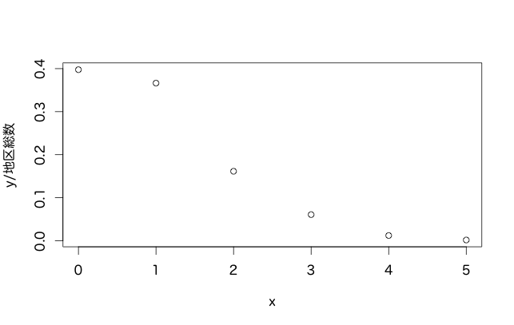

やさしいR入門 初歩から学ぶR-統計分析-
==============

# 目的 #
+ 統計ツールRの使い方をマスターする。
+ 統計分析の基礎をマスターする。

# 前提 #

# 構成 #

## [序論](#chapter1) ##

1. 統計分析
   1. 記述統計学と推測統計学
   1. 統計的手法

1. R
   1. Rの歴史
   1. Rの特徴

## [Rの基本](#chapter2) ##
1. Rののインストール
   1. インストール・ファイルの入手
   1. インストール手順
   1. Rの起動
1. 基本操作
   1. 利用形態
   1. 注意事項
   1. コマンド実例
1. グラフの作成
   1. プロット
   1. ヒストグラム
   1. その他グラフ
1. プログラミング
   1. プログラム制御
   1. 関数
   1. ファイル処理

## [確率と統計](#chapter3) ##
1. 確率
   1. 確率の基礎概念
   1. 確率の公理的定義
   1. 条件付確率
1. 確率変数と確率分布
   1. 離散確率変数
   1. 連続確率変数
   1. 主な確率分布
1. 乱数
   1. 乱数の種類
   1. 乱数の分布
   1. 乱数の平均と標準偏差

## [統計分析](#chapter4) ##
1. 代表値
   1. 平均
   1. 中央値
   1. パーセンタイル
1. 散布度
   1. 分散
   1. 標準偏差
   1. 範囲
   1. 変動係数
1. 相関係数
   1. 相関関係
   1. 相関係数

## [推定と検定](#chapter5) ##
1. 標本分布
   1. 標本抽出
   1. 標本変量
1. 推量
   1. 点推定と区間推定
   1. 母平均の推定
   1. 母分散の推定
   1. 母比率の推定
1. 検定
   1. 仮説
   1. 母平均の検定
   1. 平均値の差の検定
   1. 母分散の検定
   1. 分散の差の検定

## [単回帰分析](#chapter6) ##
1. 線回帰モデル
   1. 回帰分析
   1. 線形回帰モデルの定義
1. 最小二乗法
   1. 最小二乗法の原理
   1. 回帰直線
1. 単回帰分析の評価
   1. 決定係数
   1. 調整済み決定係数

## [重回帰分析](#chapter7) ##
1. 多変量回帰モデル
   1. 重回帰分析
   1. 多変量回帰モデルの定義
1. 最小二乗法の一般化
   1. 最小二乗法の行列表示
   1. 最小二乗推定量
1. 重回帰分析の評価
   1. 決定係数
   1. 調整済み決定係数

## [時系列分析](#chapter8) ##
1. 時系列モデル
   1. 時系列データ
   1. 移動平均
1. AR
   1. 時系列データの統計量
   1. ARモデル
1. ARIMA
   1. ARMAモデル
   1. ARIMAモデル
1. GARCH
   1. GARCHモデル
   1. 時系列用パッケージ

# 詳細 #
## <a name="chapter1">序論 ##

1. 統計分析
   1. 記述統計学と推測統計学
      + 統計学の手法を用いて現象を解析することを統計分析(statistical analysis)という。
      + 記述統計学・・・集団に属するすべてのデータを収集して、その集団の特徴を研究する統計学。
      + 推測統計学・・・集団から一部のデータを収集して、その集団の特徴を研究する統計学。
      
  1. 統計的手法
     + 基本統計量(basic statistic)・・・記述統計学の基本となるもの。「代表値」と「散布度」がある。
     + 推定(estimination)・・・推測統計学の手法。標本というデータから集団の性質を推定すること。
     + 検定(test)・・・推測統計学の手法。標本からある仮説が正しいかどうかを判定すること。
     + 回帰分析(regression analysis)・・・データから変数間の関係を直線や曲線に当てはめるもの。「単回帰分析」と「重回帰分析」がある。
     + 時系列分析(time series analysis)・・・時系列データがいかに動いているかを分析するもの。

1. R
   1. Rの歴史
   1. Rの特徴
      + データ操作
      + 統計分析
      + グラフィックス
      + プログラミング
      + パッケージ

## <a name="chapter2">Rの基本 ##
1. Rののインストール
   1. インストール・ファイルの入手
   1. インストール手順
   1. Rの起動
1. 基本操作
   1. 利用形態
   
      例題2.1 Rファイルの作成  
      「RECO201.R」  
     ```
     3*4
     x = c(1,2,3,4,5)
     y = sqrt(x)
     y
     ```
     
     実行結果
     ```     
     >source("chap2/RECO201.R", echo=TRUE)

     > 3*4
     [1] 12

     > x = c(1,2,3,4,5)

     > y = sqrt(x)

     > y
     [1] 1.000000 1.414214 1.732051 2.000000 2.236068
     ```

   1. 注意事項
      + コマンドとして使用する文字は半角英数が基本。
      + 大文字と小文字は区別される。
      + 変数の命名には、ピリオド「.」またはアンダースコア「_」を用いる。 
      + 変数の命名として次の文字は避ける。
        ```
        c,q,s,t,C,D,F,I,T,
        diff,mean,pi,range,rank,tree,var,break
        for,function,if,in,next,repeat,return,while
        ```
      + 数字は「3」「4」のように入力する。文字はシングルクォーテーション「'」またはダブルクォーテーション「"」で囲む。論理値は「T」      （新）または「F」（偽）である。
      + ユーザーが通常使用するオブジェクトは「ベクトル」と「リスト」である。
      + 計算精度はRが判断し統一的に処理する。
      + コメントは「#」以降の１行である。
      + 入力コマンドを実行するときは[Enter]キーを押す。入力途中の改行は[Shift]キーを押しながら[Enter]キーを押す。
      + 上下の矢印キーを押すと、直前に入力したコマンドから順に表示される。
      + Rには以下のような特殊記号がある。  
        ```
        NA(Not Available)・・・該当データが欠けている（欠損）
        NaN(Not a Number)・・・非数
        NaNは「0/0」のような定義できない数に対して使用される。
        Inf(Infinity)・・・無限大（プラス）
        -Inf(Infinity)・・・無限大（マイナス）
        「1/0」「-1/0」は、それぞれ「Inf」「-Inf」になる。
        NULL・・・未定義
        ある変数の値を未定義のままで、とりあえず定義したいときに用いる。
        x=NULL
        ```

   1. コマンド実例
   
      例題2.2 四則演算  
      RINT202.R
      ```
      4.0+3.0
      6.0-7.1
      5.0*3.0
      5.0/3.0
      2.0^3
      11%%3
      5%/%3
      ```
      実行結果  
      ```
      > source("chap2/RINT202.R", echo=TRUE)

      > 4.0+3.0
      [1] 7

      > 6.0-7.1
      [1] -1.1

      > 5.0*3.0
      [1] 15

      > 5.0/3.0
      [1] 1.666667

      > 2.0^3
      [1] 8

      > 11%%3
      [1] 2

      > 5%/%3
      [1] 1      
      ```      
      例題2.3 整数演算  
      RINT203.R
      ```
      round(3.643,2)
      round(3.643,0)
      trunc(3.13)
      trunc(3.67)
      trunc(-2.5)
      trunc(-2.1)
      floor(3.14)
      ceiling(2.33)
      ceiling(2.65)
      trunc(3.4)
      trunc(-3.4)
      floor(3.4)
      floor(-3.4)
      ceiling(3.4)
      ceiling(-3.4)
      ```
      実行結果  
      ```
      > source("chap2/RINT203.R", echo=TRUE)

      > round(3.643,2)
      [1] 3.64

      > round(3.643,0)
      [1] 4

      > trunc(3.13)
      [1] 3

      > trunc(3.67)
      [1] 3

      > trunc(-2.5)
      [1] -2

      > trunc(-2.1)
      [1] -2

      > floor(3.14)
      [1] 3

      > ceiling(2.33)
      [1] 3

      > ceiling(2.65)
      [1] 3

      > trunc(3.4)
      [1] 3

      > trunc(-3.4)
      [1] -3

      > floor(3.4)
      [1] 3

      > floor(-3.4)
      [1] -4

      > ceiling(3.4)
      [1] 4

      > ceiling(-3.4)
      [1] -3             
      ```
      例題2.4 数学関数  
      RINT204.R  
      ```
      pi
      abs(2.5)
      sign(2.5)
      sign(-2.5)
      sign(0.0)
      sqrt(5)
      sqrt(25)
      log(1)
      log2(8)
      log10(0.01)
      sin(0)
      sin(pi/2)
      cos(0)
      cos(pi/2)
      tan(0)
      tan(pi/2)
      tan(pi)
      atan(pi)
      atan(1)
      atan(-1/2)
      atan(-1)
      sinh(0)
      cosh(0)
      tanh(0)
      ```
      実行結果
      ```
      source("chap2/RINT204.R", echo=TRUE)

      > pi
      [1] 3.141593

      > abs(2.5)
      [1] 2.5

      > sign(2.5)
      [1] 1

      > sign(-2.5)
      [1] -1

      > sign(0.0)
      [1] 0

      > sqrt(5)
      [1] 2.236068

      > sqrt(25)
      [1] 5

      > log(1)
      [1] 0

      > log2(8)
      [1] 3

      > log10(0.01)
      [1] -2

      > sin(0)
      [1] 0

      > sin(pi/2)
      [1] 1 

      > cos(0)
      [1] 1

      > cos(pi/2)
      [1] 6.123234e-17

      > tan(0)
      [1] 0

      > tan(pi/2)
      [1] 1.633124e+16

      > tan(pi)
      [1] -1.224647e-16

      > atan(pi)
      [1] 1.262627

      > atan(1)
      [1] 0.7853982

      > atan(-1/2)
      [1] -0.4636476

      > atan(-1)
      [1] -0.7853982

      > sinh(0)
      [1] 0

      > cosh(0)
      [1] 1

      > tanh(0)
      [1] 0
      > 
      ```
      例題2.5 ベクトルによる一括計算  
      RINT205.R
      ```
      x = c(0,pi/4,pi/2,3*pi/4,pi); y = sin(x)
      y
      x2 = c(0,1,2,3,4,5); y2 = sqrt(x2)
      y2
      ```
      実行結果
      ```
      source("chap2/RINT205.R", echo=TRUE)

      > x = c(0,pi/4,pi/2,3*pi/4,pi); y = sin(x)

      > y
      [1] 0.000000e+00 7.071068e-01 1.000000e+00 7.071068e-01 1.224647e-16

      > x2 = c(0,1,2,3,4,5); y2 = sqrt(x2)

      > y2
      [1] 0.000000 1.000000 1.414214 1.732051 2.000000 2.236068      
      ```
      例題2.6 代入演算  
      RINT206.R
      ```
      a=4
      b=-5
      a+b; a-b; a*b; a/b
      a^2+b^2
      y=x=8
      x
      y
      ```
      実行結果
      ```
      >source("chap2/RINT206.R", echo=TRUE)

      > a=4

      > b=-5

      > a+b; a-b; a*b; a/b
      [1] -1
      [1] 9
      [1] -20
      [1] -0.8

      > a^2+b^2
      [1] 41

      > y=x=8

      > x
      [1] 8

      > y
      [1] 8
      ```
      例題2.7 ベクトルの成分の和と積  
      RINT207.R
      ```      
      x=c(2,3,4,5)
      sum(x)
      prod(x)
      ```
      実行結果
      ```
      > source("chap2/RINT207.R", echo=TRUE)

      > x=c(2,3,4,5)

      > sum(x)
      [1] 14

      > prod(x)
      [1] 120      
      ```                 
      例題2.8 基本統計計算  
      RINT208.R
      ```
      x=c(4,7,9,20,-10,5,8,-3,-9,3)
      max(x)
      min(x)
      cummax(x)
      cummin(x)
      cumsum(x)
      cumprod(x)
      range(x)
      mean(x)
      var(x)
      sd(x)
      ```
      実行結果
      ```
      > source("chap2/RINT208.R", echo=TRUE)

      > x=c(4,7,9,20,-10,5,8,-3,-9,3)

      > max(x)
      [1] 20

      > min(x)
      [1] -10

      > cummax(x)
       [1]  4  7  9 20 20 20 20 20 20 20

      > cummin(x)
       [1]   4   4   4   4 -10 -10 -10 -10 -10 -10

      > cumsum(x)
       [1]  4 11 20 40 30 35 43 40 31 34

      > cumprod(x)
       [1]          4         28        252       5040     -50400    -252000
       [7]   -2016000    6048000  -54432000 -163296000

      > range(x)
      [1] -10  20

      > mean(x)
      [1] 3.4

      > var(x)
      [1] 79.82222

      > sd(x)
      [1] 8.934328      
      ```
      例題2.9 集合演算  
      RINT209.R      
      ```
      a = c(2,4,6,8)
      b = c(4,8,12,14,16)
      union(a,b)
      intersect(a,b)
      setdiff(a,b)
      ```
      実行結果
      ```
      > source("chap2/RINT209.R", echo=TRUE)

      > a = c(2,4,6,8)

      > b = c(4,8,12,14,16)

      > union(a,b)
      [1]  2  4  6  8 12 14 16

      > intersect(a,b)
      [1] 4 8

      > setdiff(a,b)
      [1] 2 6      
      ```
      例題2.10 ベクトル演算  
      RINT210.R
      ```
      a = c(1,2)
      b = c(3,4)
      a+b; a-b; a*b
      -a; 5*b
      a%*%b
      l = c(2,4,6,8)
      rev(l)
      x=c(2,6,9,12,15,18)
      x[3]
      x[[3]]
      x[5]
      x[7]
      b = x[c(2:4)]; b
      c = x[-c(2:4)]; c
      d = x[x>10]; d
      y = c(1,2,4)
      s = rep(y,times=4)
      s
      ```
      実行結果
      ```
      > source("chap2/RINT210.R", echo=TRUE)

      > a = c(1,2)

      > b = c(3,4)

      > a+b; a-b; a*b
      [1] 4 6
      [1] -2 -2
      [1] 3 8

      > -a; 5*b
      [1] -1 -2
      [1] 15 20

      > a%*%b
           [,1]
      [1,]   11

      > l = c(2,4,6,8)

      > rev(l)
      [1] 8 6 4 2

      > x=c(2,6,9,12,15,18)

      > x[3]
      [1] 9

      > x[[3]]
      [1] 9

      > x[5]
      [1] 15

      > x[7]
      [1] NA

      > b = x[c(2:4)]; b
      [1]  6  9 12

      > c = x[-c(2:4)]; c
      [1]  2 15 18

      > d = x[x>10]; d
      [1] 12 15 18

      > y = c(1,2,4)

      > s = rep(y,times=4)

      > s
       [1] 1 2 4 1 2 4 1 2 4 1 2 4      
      ```
      例題2.11 行列  
      RINT211.R
      ```
      # 行列
      A = array(dim=c(2,2))
      A[1,1] = 1; A[1,2] = 2; A[2,1] = -1; A[2,2] = -1
      A
      # matrixを使った場合
      p = c(1,2,-1,-1)
      A = matrix(p,2,2,byrow=T)
      A
      # 2x3行列の定義
      C = matrix(c(1,2,3,4,5,6),2,3,byrow=T)
      C
      # 3x3のゼロ行列
      O = matrix(0,nrow=3,ncol=3)
      O
      # 行列の和、差、積
      A = matrix(c(1,2,-1,-1),2,2,byrow=T)
      B = matrix(c(1,1,1,1),2,2,byrow=T)
      C = A+B; C
      # 逆行列
      A = matrix(c(1,2,-1,-1),2,2,byrow=T); A
      B = solve(A); B
      A%*%B
      B%*%A
      ```
      実行結果
      ```
      >source("chap2/RINT211.R", echo=TRUE)

      > # 行列
      > A = array(dim=c(2,2))

      > A[1,1] = 1; A[1,2] = 2; A[2,1] = -1; A[2,2] = -1

      > A
           [,1] [,2]
      [1,]    1    2
      [2,]   -1   -1

      > # matrixを使った場合
      > p = c(1,2,-1,-1)

      > A = matrix(p,2,2,byrow=T)

      > A
           [,1] [,2]
      [1,]    1    2
      [2,]   -1   -1

      > # 2x3行列の定義
      > C = matrix(c(1,2,3,4,5,6),2,3,byrow=T)

      > C
           [,1] [,2] [,3]
      [1,]    1    2    3
      [2,]    4    5    6

      > # 3x3のゼロ行列
      > O = matrix(0,nrow=3,ncol=3)

      > O
           [,1] [,2] [,3]
      [1,]    0    0    0
      [2,]    0    0    0
      [3,]    0    0    0

      > # 行列の和、差、積
      > A = matrix(c(1,2,-1,-1),2,2,byrow=T)

      > B = matrix(c(1,1,1,1),2,2,byrow=T)

      > C = A+B; C
           [,1] [,2]
      [1,]    2    3
      [2,]    0    0

      > # 逆行列
      > A = matrix(c(1,2,-1,-1),2,2,byrow=T); A
           [,1] [,2]
      [1,]    1    2
      [2,]   -1   -1

      > B = solve(A); B
           [,1] [,2]
      [1,]   -1   -2
      [2,]    1    1

      > A%*%B
           [,1] [,2]
      [1,]    1    0
      [2,]    0    1

      > B%*%A
           [,1] [,2]
      [1,]    1    0
      [2,]    0    1
      > 
      ```
      例題2.12 固有値  
      RINT212.R
      ```
      A = matrix(c(7,4,3,6),2,2,byrow=T); A
      eigen(A)
      L1 = A%*%eigen(A)$vectors[,1]; L1
      R1 = eigen(A)$values[1]*matrix(eigen(A) + $vectors[,1],2,1); R1
      L2 = A%*%eigen(A)$vectors[,2]; L2
      R2 = eigen(A)$values[2]*matrix(eigen(A) + $vectors[,2],2,1); $2
      ```
      実行結果
      ```
      > source("chap2/RINT212.R", echo=TRUE)

      > A = matrix(c(7,4,3,6),2,2,byrow=T); A
           [,1] [,2]
      [1,]    7    4
      [2,]    3    6

      > eigen(A)
      $values
      [1] 10  3

      $vectors
           [,1]       [,2]
      [1,]  0.8 -0.7071068
      [2,]  0.6  0.7071068


      > L1 = A%*%eigen(A)$vectors[,1]; L1
           [,1]
      [1,]    8
      [2,]    6

      > R1 = eigen(A)$values[1]*matrix(eigen(A)
      +     $vectors[,1],2,1); R1
           [,1]
      [1,]    8
      [2,]    6

      > L2 = A%*%eigen(A)$vectors[,2]; L2
               [,1]
      [1,] -2.12132
      [2,]  2.12132

      > R2 = eigen(A)$values[2]*matrix(eigen(A) 
      + $vectors[,2],2,1); R2
               [,1]
      [1,] -2.12132
      [2,]  2.12132      
      ```
      例題2.13 連立方程式  
      RINT213.R
      ```
      a=matrix(c(2,1,3,-5),2,2)
      a
      b=matrix(c(11,-14))
      b
      solve(a,b)      
      ```
      実行結果
      ```
      >source("chap2/RINT213.R", echo=TRUE)

      > a=matrix(c(2,1,3,-5),2,2)

      > a
           [,1] [,2]
      [1,]    2    3
      [2,]    1   -5

      > b=matrix(c(11,-14))

      > b
           [,1]
      [1,]   11
      [2,]  -14

      > solve(a,b)      
           [,1]
      [1,]    1
      [2,]    3      
      ```
      例題2.14 微分と積分  
      RINT214.R
      ```
      f = expression(sin(x))
      D(f,"x")
      f=expression(3*x^2+6*x)
      D(f,"x")
      deriv(y~sin(x),"x")
      g=deriv(y~3*x^2+6*x,"x",func=TRUE)
      g
      g(3)
      g(4)
      f=function(x) x^3
      integrate(f,0,1)
      integrate(sqrt,1,4)
      ```
      実行結果
      ```
      > source("chap2/RINT214.R", echo=TRUE)

      > f = expression(sin(x))

      > D(f,"x")
      cos(x)

      > f=expression(3*x^2+6*x)

      > D(f,"x")
      3 * (2 * x) + 6

      > deriv(y~sin(x),"x")
      expression({
          .value <- sin(x)
          .grad <- array(0, c(length(.value), 1L), list(NULL, c("x")))
          .grad[, "x"] <- cos(x)
          attr(.value, "gradient") <- .grad
          .value
      })

      > g=deriv(y~3*x^2+6*x,"x",func=TRUE)

      > g
      function (x) 
      {
          .value <- 3 * x^2 + 6 * x
          .grad <- array(0, c(length(.value), 1L), list(NULL, c("x")))
          .grad[, "x"] <- 3 * (2 * x) + 6
          attr(.value, "gradient") <- .grad
          .value
      }

      > g(3)
      [1] 45
      attr(,"gradient")
            x
      [1,] 24

      > g(4)
      [1] 72
      attr(,"gradient")
            x
      [1,] 30

      > f=function(x) x^3
      
      > integrate(f,0,1)
      0.25 with absolute error < 2.8e-15

      > integrate(sqrt,1,4)
      4.666667 with absolute error < 5.2e-14      
      ```
      例題2.15 データの名前付け  
      RINT215.R
      ```
      mydata=c(10,20,30,40,50,60,70,80,90,100)
      names(mydata)=c('a','b','c','d','e','f','g','h','i','j')
      mydata
      mydata['d']
      mydata['i']
      # 名前付きのベクトルデータの名前の削除
      names(mydata) = NULL
      mydata
      ```
      実行結果
      ```
      > source("chap2/RINT215.R", echo=TRUE)

      > mydata=c(10,20,30,40,50,60,70,80,90,100)

      > names(mydata)=c('a','b','c','d','e','f','g','h','i','j')

      > mydata
        a   b   c   d   e   f   g   h   i   j 
       10  20  30  40  50  60  70  80  90 100 

      > mydata['d']
       d 
      40 

      > mydata['i']
       i 
      90
      > # 名前付きのベクトルデータの名前の削除
      > names(mydata) = NULL

      > mydata
      [1]  10  20  30  40  50  60  70  80  90 100      
      ```
      例題2.16 リスト  
      RINT216.R
      ```
      akama = list(name="Akama",sex="m",age=50)
      akama
      akama$name
      akama$sex
      # 縦に出力
      unlist(akama)
      # データの追加と削除
      akama = c(akama,job="scientist")
      akama
      akama = -c(akama,job="scientist")
      akama      
      ```
      実行結果
      ```
      > source("chap2/RINT216.R", echo=TRUE)

      > akama = list(name="Akama",sex="m",age=50)

      > akama
      $name
      [1] "Akama"

      $sex
      [1] "m"

      $age
      [1] 50


      > akama$name
      [1] "Akama"

      > akama$sex
      [1] "m"

      > # 横に出力
      > unlist(akama)            
         name     sex     age 
      "Akama"     "m"    "50"
      > # データの追加
      > akama = c(akama,job="scientist")

      > akama
      $name
      [1] "Akama"

      $sex
      [1] "m"

      $age
      [1] 50

      $job
      [1] "scientist"
      
      ```
      例題2.17 ソート  
      RINT217.R
      ```
      x = runif(16,0,1)
      x
      y = sort(x)
      y
      z = sort(x,decreasing = TRUE)
      z
      # 順位を６番目まで抜き出す
      yy = y[y<=y[6]]
      yy
      ```
      実行結果
      ```
      > source("chap2/RINT217.R", echo=TRUE)

      > x = runif(16,0,1)

      > x
       [1] 0.94963211 0.72249295 0.01519969 0.05427334 0.16874944 0.72603391
       [7] 0.62532158 0.89137798 0.61730700 0.79670304 0.99447591 0.35835185
      [13] 0.95486745 0.64800517 0.52091145 0.35324553

      > y = sort(x)

      > y
       [1] 0.01519969 0.05427334 0.16874944 0.35324553 0.35835185 0.52091145
       [7] 0.61730700 0.62532158 0.64800517 0.72249295 0.72603391 0.79670304
      [13] 0.89137798 0.94963211 0.95486745 0.99447591

      > z = sort(x,decreasing = TRUE)

      > z
       [1] 0.99447591 0.95486745 0.94963211 0.89137798 0.79670304 0.72603391
       [7] 0.72249295 0.64800517 0.62532158 0.61730700 0.52091145 0.35835185
      [13] 0.35324553 0.16874944 0.05427334 0.01519969

      > # 順位を６番目まで抜き出す
      > yy = y[y<=y[6]]

      > yy
      [1] 0.01519969 0.05427334 0.16874944 0.35324553 0.35835185 0.52091145      
      ```
      例題2.18 データ・フレーム  
      
      stretch  | distance
      -------- | --------
      46       | 148
      56       | 182
      48       | 173
      50       | 166
      44       | 109
      42       | 141
      52       | 166

      RINT218.R
      ```
      myframe = data.frame(stretch=c(6,56,48,50,44,42,52),distance=c(148,183,173,166,109,141,166))
      myframe
      mystretch = myframe$stretch
      mystretch
      # 欠損値の扱い
      x=c(10,20,30,40,50,60)
      y=c(102,NA,289,409,NA,630)
      x
      y
      ```
      実行結果
      ```
      > source("chap2/RINT218.R", echo=TRUE)

      > myframe = data.frame(stretch=c(46,56,48,50,44,42,52),distance=c(148,182,173,166,109,141,166))

      > myframe
        stretch distance
      1      46      148
      2      56      182
      3      48      173
      4      50      166
      5      44      109
      6      42      141
      7      52      166

      > mystretch = myframe$stretch

      > mystretch
      [1] 46 56 48 50 44 42 52
      > # 欠損値の扱い
      > x=c(10,20,30,40,50,60)

      > y=c(102,NA,289,409,NA,630)

      > x
      [1] 10 20 30 40 50 60

      > y
      [1] 102  NA 289 409  NA 630      
      ```
      例題2.20 数列  
      RINT220.R
      ```
      # 1から15までの刻みで数列を発生させる
      s = seq(1,15,by=1); s
      # データを画面から入力する
      x = scan()
      x
      ```
      実行結果
      ```
      > source("chap2/RINT219.R", echo=TRUE)

      > # 1から15までの刻みで数列を発生させる
      > s = seq(1,15,by=1); s
       [1]  1  2  3  4  5  6  7  8  9 10 11 12 13 14 15

      > # データを画面から入力する
      > x = scan()
      1: 10
      2: 20
      3: 30
      4: 40
      5: 
      Read 4 items

      > x
      [1] 10 20 30 40      
      ```      

1. グラフの作成
   1. プロット
      例題2.21 関数のグラフ  
      RINT221.R
      ```
      # plotを使った場合
      x = seq(-3,3,len=100)
      y = x^2
      plot(x,y,type='l',xlab='x',ylab='y',main='y=x-2')
      # curveを使った場合
      curve(x^2,-3,3,type='l',xlab = 'x',ylab='y',main='y= x^2')
      ```
      
      実行結果  
      

      例題2.22 複数のグラフ  
      RINT222.R
      ```
      curve(sin(x),-2*pi,xlab='x',ylab='y',main='y=sin(x),cos(x)')
      curve(cos(x),-2*pi,2*pi,add=TRUE)
      ```

      実行結果  
      

      例題2.23 グラフの保存  
      RINT223.R
      ```
      # pngで保存
      png('img/graph.png')
      curve(x^2,-3,3,main='y=x^2')
      dev.off()
      # epsで保存
      postscript('img/graph.eps',paper='special',width=4,height=4,horizontal=FALSE)
      curve(x^2,-3,3,main='y=x^2')
      dev.off()
      ```

   1. ヒストグラム
      例題2.24 ヒストグラム  
      RINT224.R
      ```
      x = rnorm(1000)
      par(family="HiraMaruProN-W4")
      hist(x,25,xlab='正規乱数値',ylab='度数',main='正規分布図(n=1000)')
      ```
      
      実行結果  
      

   1. その他グラフ
      例題2.25 対数グラフ  
      RINT225.R
      ```
      # 指数関数的データのプロット
      x=c(1,2,3,4,5)
      y=c(1/2,1/2^2,1/2^3,1/2^4,1/2^5)
      plot(x,y)
      # 片対数グラフ
      plot(x,y,log='y')
      # べき乗関数的データのプロット
      x=c(1,2,3,4,5)
      y=c(1.4,9,16,25)
      plot(x,y)
      # 両対数グラフ
      plot(x,y,log='xy')
      ```
      
      実行結果  
      
      
      
                  

      例題2.26 グラフの整形
      RINT226.R
      ```
      x = 1:10
      y = sqrt(x)
      par(family="HiraMaruProN-W4")      
      plot(x,y,xlab='x',ylab=expression(sqrt(x)),
        type='l',
        main = ' 平方根のグラフ'
        )
      ```
      
      実行結果  
      

      例題2.27 ボックス・プロット  
      RINT227.R
      ```
      a = c(79.98,80.04,80.02,80.04,80.03,80.03,80.04,79.97,80.05,80.03,80.02,80.00,80.02)
      b = c(80.02,79.94,79.98,79.98,79.97,79.97,80.03,79.95,79.97)
      boxplot(a,b)
      ```
      
      実行結果  
      

      例題2.28 幹一葉グラフ  
      RINT228.R
      ```
      x = c(18,49,3,5,18,0,27,11,32,22,53,0,7,45,36)
      stem(x,scale=2)
      ```
      実行結果
      ```
      > source("chap2/RINT228.R", echo=TRUE)

      > x = c(18,49,3,5,18,0,27,11,32,22,53,0,7,45,36)

      > stem(x,scale=2)

        The decimal point is 1 digit(s) to the right of the |

        0 | 00357
        1 | 188
        2 | 27
        3 | 26
        4 | 59
        5 | 3      
      ```

      例題2.29 棒グラフ  
      RINT229.R
      ```
      # 縦棒グラフ
      x = c(1,2,3,4,5,6,7,8,9,10)
      y = c(170,185,169,184,177,178,181,170,168,190)
      barplot(y,xlab='nuber',ylab='value',main='barchart',names.arg=x,ylim=c(0,200))
      # 横棒グラフ
      x = c(1,2,3,4,5,6,7,8,9,10)
      y = c(170,185,169,184,177,178,181,170,168,190)
      barplot(y,xlab='value',ylab='number',main='barchart',names.arg=x,xlim=c(0,200),horiz=TRUE)
      ```
      
      実行結果  
      
            
      
      例題2.30 円グラフ  
      RINT230.R
      ```
      phone = c(47,27,20,2,3)
      names(phone) = c('DoCoMo','au','Softbank','Emobile','Wilcom')
      phone.col = c('red','green','white','yellow','cyan')
      par(family="HiraMaruProN-W4")                  
      pie(phone,radius=0.9,col=phone.col,main=' 携帯電話のシェア')
      ```
      
      実行結果  
      
      
1. プログラミング

   1. プログラム制御

      例題2.31 条件判定  
      RINT231.R
      ```
      a = scan()
      if (a>0) print('a is positive') else print('a is not positive')
      ```
      実行結果
      ```
      > source("chap2/RINT231.R", echo=TRUE)

      > a = scan()
      1: 3
      2: 
      Read 1 item

      > if (a>0) print('a is positive') else print('a is not positive')
      [1] "a is positive"
      > source("chap2/RINT231.R", echo=TRUE)

      > a = scan()
      1: -6
      2: 
      Read 1 item

      > if (a>0) print('a is positive') else print('a is not positive')
      [1] "a is not positive"   
      ```   

      例題2.32 繰り返し(for)  
      RINT232.R
      ```
      n = scan()
      s = 0
      for(i in 1:n)
      {
          s = s + i
       }
       print(s)
      ```
      実行結果
      ```
      > source("chap2/RINT232.R", echo=TRUE)

      > n = scan()
      1: 10
      2: 
      Read 1 item

      > s = 0

      > for(i in 1:n)
      + {
      +     s = s + i
      + }

      > print(s)
      [1] 55    
      ```
    
      例題2.33 繰り返し(while)  
      RINT233.R
      ```
      n = scan()
      s = 0
      i = 0
      while(i <= n)
      {
        s = s+i
        i = i+1
      }
      print(s)
      ```
      実行結果
      ```
      > source("chap2/RINT233.R", echo=TRUE)

      > n = scan()
      1: 10
      2: 
      Read 1 item

      > s = 0

      > i = 0

      > while(i <= n)
      + {
      +     s = s+i
      +     i = i+1
      + }
  
      > print(s)
      [1] 55
      ```
    
   1. 関数
   
      例題2.34 関数  
      RINT234.R
      ```
      # プログラム RINT234.R
      # 1からnまでの整数の和を求める。
      RINT234 = function(n)
          {
              s = 0
              for(i in 1:n)
                  {
                      s = s+i
                  }
              print(s)
          }    
      ```
      実行結果
      ```
      > source("chap2/RINT234.R", echo=TRUE)
      > # プログラム RINT234.R
      > # 1からnまでの整数の和を求める。
      > RINT234 = function(n)
      +     {
      +         s = 0
      +         for(i in 1:n)
      +             {
      +                 s = .... [TRUNCATED] 
      > RINT234(100)
      [1] 5050    
      ```

      例題2.35 再帰呼び出し  
      RINT235.R
      ```
      # プログラム RINT235.R
      # xの階乗を求める。
      fact = function(x)
          {
              ifelse(x==0,1,x*fact(x-1))
          }
      ```
      実行結果
      ```
      > source("chap2/RINT235.R", echo=TRUE)

      > # プログラム RINT235.R
      > # xの階乗を求める。
      > fact = function(x)
      +     {
      +         ifelse(x==0,1,x*fact(x-1))
      +     }
      > fact(10)
      [1] 3628800
      > fact(0)
      [1] 1
      > fact(1)
      [1] 1    
      ```
    
   1. ファイル処理

      例題2.36 ファイル読み込み  
      read.csv  
      ```
      1,2,3,4,5,6,7,8,9,10
      ```      
      RINT236.R
      ```
      x = read.csv("chap2/rint236.txt",header=FALSE,sep=",")
      x
      y = 1:10
      y
      mean(y)      
      ```
      実行結果
      ```
      > source("chap2/RINT236.R", echo=TRUE)

      > x = read.csv("chap2/rint236.txt",header=FALSE,sep=",")

      > x
        V1 V2 V3 V4 V5 V6 V7 V8 V9 V10
      1  1  2  3  4  5  6  7  8  9  10

      > y = 1:10

      > y
       [1]  1  2  3  4  5  6  7  8  9 10

      > mean(y)
      [1] 5.5      
      ```

      例題2.37 ファイルへの書き込み  
      RINT237.R
      ```
      x = c(1,2,3,4,5,6,7,8,9,10)
      write(x,"chap2/output.txt",sep = " ",ncolumns=10)
      write(c("mean(x)=",mean(x)), "chap2/output.txt",append=TRUE)      
      ```
      実行結果
      ```
      >source("chap2/RINT237.R", echo=TRUE)

      > x = c(1,2,3,4,5,6,7,8,9,10)

      > write(x,"chap2/output.txt",sep = " ",ncolumns=10)

      > write(c("mean(x)=",mean(x)), "chap2/output.txt",append=TRUE)
      >       
      ```

      例題2.38 Excelデータの読み込み  
      Rdata.csv
      
      年齢  | 身長 | 体重
      ----- | -----| -----
      20    | 176  | 71
      23    | 181  | 78
      21    | 173  | 80
      19    | 179  | 82


      RINT238.R
      ```
      mydata = read.table("chap2/Rdata.csv",header=TRUE,sep=",")
      mydata
      sprintf("身長平均 = %5.2f", mean(mydata$身長))
      sprintf("体重平均 = %5.2f", mean(mydata$体重))      
      ```
      実行結果
      ```
      > source("chap2/RINT238.R", echo=TRUE)

      > mydata = read.table("chap2/Rdata.csv",header=TRUE,sep=",")

      > mydata
        年齢 身長 体重
      1   20  176   71
      2   23  181   78
      3   21  173   80
      4   19  179   82

      > sprintf("身長平均 = %5.2f", mean(mydata$身長))
      [1] "身長平均 = 177.25"

      > sprintf("体重平均 = %5.2f", mean(mydata$体重))
      [1] "体重平均 = 77.75"      
      ```

      例題2.39 ファイル読み込み  
      RINT239.R
      ```
      mydata2 = data.frame(
          年齢 = c(20,23,21,19),
          身長 = c(176,181,173,179),
          体重 = c(71,78,80,82))
      write.table(mydata2,"chap2/sample.csv",sep=",",row.names=FALSE)
      yy = read.table("chap2/sample.csv",header=TRUE,sep=",")
      yy      
      ```
      実行結果
      ```
      > source("chap2/RINT239.R", echo=TRUE)

      > mydata2 = data.frame(
      +     年齢 = c(20,23,21,19),
      +     身長 = c(176,181,173,179),
      +     体重 = c(71,78,80,82))

      > write.table(mydata2,"chap2/sample.csv",sep=",",row.names=FALSE)

      > yy = read.table("chap2/sample.csv",header=TRUE,sep=",")

      > yy
        年齢 身長 体重
      1   20  176   71
      2   23  181   78
      3   21  173   80
      4   19  179   82      
      ```
      
## <a name="chapter3">確率と統計 ##
1. 確率

   確率(probability)は、ある事象が起こる確からしさを「0」「1」の間の１つの実数値で表したものである。  
   試行(trial)・・・観測や実験。  
   事象(event)・・・試行によって生じる様々な結果の集合。ある事象をAとするとき、Aの起こる確率をP(A)と書くことにする。  

   1. 確率の基礎概念  
      いま、すべての事象の集合を$\Omega$とすると、ある１つの事象Aは$\Omega$の部分集合と考えられる。  
      なお、$\Omega$の部分集合A,B,..について定義される集合を次のように表記する。  
      + $A^{c}$・・・Aの補集合(complement)        
      + ${A}\cup{B}$・・・AとBの結合集合(union)        
      + ${A}\cap{B}$・・・AとBの共通集合(intersection)        
      + $\emptyset$ ・・・空集合(empty set)                
   1. 確率の公理的定義  
      いま、$\Omega$のすべての部分集合の集合(べき集合)をSとすると、確率の公理システムは次の３つの公理からなる。  
      + $(P1)任意の事象A \in Sについて、P(A) \leq １である。$
      + $(P2)事象A \in Sが確実に起こるならば、P(A) = 1である。$
      + $(P3)事象A,B \in Sが互いに排反ならば、P(A \cup B) = P(A) + P(B)である。$
   1. 条件付確率
      事象A,Bについて$P(A) \neq 0$ならば、Aが起こったときのBの条件付確率(conditional probablility)は$P(B \mid A)$と書く。  
      $$
      P(B \mid A) = \frac{P(A \cap B)}{P(A)}
      $$
1. 確率変数と確率分布  

    確率変数(rondom variable)・・・事象を表す変数のこと。  
   
   1. 離散確率変数  
      いま、確率変数の定義域を${a_{1},a_{2},...}$とし、$P(X = a_{i})$が与えられているとき、Xを離散確率変数という。  
      $P(X = a_{i}) = p_{i}$としたとき
      $$
      (a_{i},p_{i})(i = 1,2,...\sum_{i}^{}a_{i}p_{i} = 1)
      $$
      はXの確率分布(probability distribution)という。
      一般に、確率変数に対して、平均値(average),分散(variance)、標準偏差値(standard deviation)の概念を定義できる。  
      + Xの平均値:$E(X) = \sum_{i}^{}a_{i}p_{i}$
      + Xの分散:  $V(X) = E((X-E(X))^{2})$
      + Xの標準編纂: $\sigma X = \sqrt{V(X)}$
   1. 連続確率変数
      連続確率変数は、ある値を取る確率ではなく、取る値がある区間に入る確率を表す。  
      いま、dxを微小な項とし、
      $$
      P(x < X \leq x + dx) = f(x)dx
      $$
      とするとき、Xは連続確率変数といい、f(x)はXの確率密度関数(probability density function)という。  
      よって、次の関係が成り立つ。
      $$
      P(a < X \leq b) = \int_{a}^{b}f(x)dx
      $$
      連続確率変数では、平均値、分散、標準偏差は以下のように定義される。 
      $$E(X) = \int_{- \infty}^{\infty}xf(x)dx$$      
      $$V(X) = \int_{- \infty}^{\infty}(x - E(X))^{2}f(x)dx$$
      $$\sigma x = \sqrt{V(X)}$$
      確率変数Xの取る値が$x_{i}$ であり、x以下である確率を考えると、この関数はxの関数となるが、これを分布関数(distribution function)という。
      $$
      F(x) = P(X \leq x)(- \infty \leq x \leq \infty)
      $$
      連続確率変数の分布関数は、なめらかな関数となる。  
      $$
      P(a < x \leq) = F(b) - F(a) = \int_{a}^{b}f(x)dx
      $$
      離散確率変数の分布関数
      $$
      F(x) = \sum_{xk \leq x}^{}pk
      $$
      
   1. 主な確率分布  
      ある事象Eの起こる確率をpとし、試行を何回も独立に行ったとする。このような試行をn回繰り返したときに、r回Eの起こる確率P(X = r)は
      $$
      P(X = r) = {}_n C_r p^{r}(1 - p)^{n - r}
      $$
      ２項分布は、以下の性質を満足する。  
      $$
      \sum_{r=0}^{n}P(X = r) = \sum_{r=0}^{n} {}_n C_r p^{r}(1 - p)^{n - r} = 1
      $$

      例題3.1 ２項分布  
      RINT301.R
      ```
      x = 0:50
      y = dbinom(x,50,0.25)
      par(family="HiraMaruProN-W4")                  
      plot(x,y,type='h',xlab='x',ylab='y',main=' 二項分布')
      ```

      実行結果  
      
      
      ポアソン分布
      
  $$
  P(X = r) = \frac{ \lambda^{r}}{r!}e^{-\lambda} (\lambda > 0)
  $$

      例題3.2 ポワソン分布  
      RINT302.R
      ```
      x = 0:7
      y = dpois(x,3)
      par(family="HiraMaruProN-W4")                  
      plot(x,y,type='l',xlab='x',ylab='y',main=' ポワソン分布')
      ```
     
      実行結果  
      

      正規分布

   $$
   f(x) = \frac{1}{\sqrt{2\pi\sigma}}e^{-\frac{(x-\mu^{2})}{2\sigma^{2}}}
   $$
   標準正規分布(standardized normal distribution)
   $$
   f(x) = \frac{1}{\sqrt{2\pi}}e^{-\frac{x^{2}}{2}}
   $$
   
      例題3.3 正規分布  
      RINT303.R
      ```
      x = seq(-5,5,by=0.1)
      y = dnorm(x,0,1)
      par(family="HiraMaruProN-W4")                  
      plot(x,y,type='l',xlab='x',ylab='y',main=' 標準正規分布 N(1,0)')
      ```
     
      実行結果  
      

      一様分布

   $$
   f(x) = \frac{1}{b-a} ( x \in [a,b])
   $$
   $$
   f(x) = 0 (x not \in [a,b])
   $$
   
      例題3.4 一様分布  
      RINT304.R
      ```
      x = 0:1
      y = dunif(x,0,1)
      par(family="HiraMaruProN-W4")                  
      plot(x,y,type='l',xlab='x',ylab='y',main=' 一様分布')
      ```
     
      実行結果  
      

      例題3.5 二項分布の平均値と分散  
      １２個のサイコロを同時に投げて、「５」または「６」の目が出た回数。
      
      回数  |  0   | 1    | 2    | 3   | 4   | 5   | 6   | 7   | 8   | 9   | 10  | 11  | 12  |
      ----- | -----| -----| -----|-----|-----|-----|-----|-----|-----|-----|-----|-----|-----|
      度数  |  185 | 1149 | 3265 | 5475| 6114| 5194| 3067| 1331| 403 | 105 | 18  | 0   | 0   |

      RINT305.R
      ```
      x = c(0,1,2,3,4,5,6,7,8,9,10,11,12)
      x
      y=c(185,1149,3265,5475,6114,5194,3067,1331,403,105,19,0,0)
      y
      n=sum(y)
      heikin=sum(x*y)/n
      heikin
      bunsan=sum((x-heikin)^2*y/n)
      bunsan
      # 実験による結果
      par(family="HiraMaruProN-W4")                  
      plot(y/n~x,xlab="x",ylab="確率(実験)")
      # ２項分布B(12,1/3)
      pp=dbinom(0:12,size=12,prob=1/3)
      pp
      par(family="HiraMaruProN-W4")                  
      plot(pp,xlab="x",ylab="確率")
      ```
     
      実行結果  
      
      

      例題3.6 ポワソン分布の確認  
      ロンドンの南部地区を567個に分けて、それらの地区がV-2により何度爆撃されたかを調べた結果
      
      回数    |  0   | 1    | 2    | 3   | 4   | 5   | 6以上|
      ------- | -----| -----| -----|-----|-----|-----|------|
      地区数  |  229 | 211  | 93   | 35  | 7   | 1   | 0    |

      RINT306.R
      ```
      x = c(0,1,2,3,4,5)
      x
      y = c(229,211,93,35,7,1)
      y
      地区総数 = sum(y)
      地区総数
      平均 = sum(x*y)/地区総数
      平均
      分散 = sum((x-平均)^2*y)/地区総数
      分散
      # データによる結果
      par(family="HiraMaruProN-W4")                  
      plot(y/地区総数~x)
      # ポワソン分布
      pd = dpois(x=0:5,lambda=平均)
      par(family="HiraMaruProN-W4")                  
      plot(pd,xlab='x',ylab='Poison 分布')
      ```
     
      実行結果  
      
      

      例題3.7 正規分布の確認  
      標準正規分布の平均(=0)と分散(=1)を正規乱数1000個を用いて確認。      
      
      RINT307.R
      ```
      x = rnorm(10000)
      mean(x)
      sd(x)
      ```
     
      実行結果  
      ```
      > source("chap3/RINT307.R", echo=TRUE)

      > x = rnorm(10000)

      > mean(x)
      [1] -0.008778838

      > sd(x)
      [1] 1.007761      
      ```      

1. 乱数
   1. 乱数の種類
      + 正規乱数(normal random number)・・・正規分布に従う乱数。
      + 一様乱数(uniform random number)・・・ある区間内のすべての実数が同じ確率で出現する乱数。
      + 擬似乱数(pseudo-random number)・・・コンピュータで生成される乱数であり、前の乱数の値から次の乱数の値を計算して乱数を発生させる。     
   1. 乱数の分布
      例題3.8 正規乱数とヒストグラム

      RINT308.R
      ```
      # ヒストグラム(1000個、25分割)
      x = rnorm(1000)
      par(family="HiraMaruProN-W4")                  
      hist(x,25,xlab=' 正規乱数値',ylab=' 度数',main=' 正規分布(n=1000)')
      # ヒストグラム(1000個、30分割)
      x = rnorm(1000)
      par(family="HiraMaruProN-W4")                  
      hist(x,30,xlab=' 正規乱数値',ylab=' 度数',main=' 正規分布(n=1000)')
      # ヒストグラムと近似曲線(1000個、30分割)
      x = rnorm(1000)
      par(family="HiraMaruProN-W4")                  
      hist(x,30,prob=TRUE,xlab=' 正規乱数値',ylab=' 度数',main=' ヒストグラムと近似曲線')
      lines(density(x))      
      ```
     
      実行結果  
      
      
      

      例題3.9 二項乱数

      RINT309.R
      ```
      pp = rbinom(1000,size=1,p=0.5)
      sum(pp)
      pp = rbinom(1000,size=1,p=0.5)
      sum(pp)
      ```
     
      実行結果  
      ```
      > source("chap3/RINT309.R", echo=TRUE)

      > pp = rbinom(1000,size=1,p=0.5)

      > sum(pp)
      [1] 500

      > pp = rbinom(1000,size=1,p=0.5)

      > sum(pp)
      [1] 485      
      ``` 
      
   1. 乱数の平均と標準偏差

      例題3.10 一様乱数

      RINT310.R
      ```
      set.seed(123)
      x = runif(10)
      x
      mean(x)
      sd(x)
      set.seed(123)
      x = runif(10)
      x
      ```
     
      実行結果  
      ```
      > source("chap3/RINT310.R", echo=TRUE)

      > set.seed(123)

      > x = runif(10)

      > x
       [1] 0.2875775 0.7883051 0.4089769 0.8830174 0.9404673 0.0455565 0.5281055
       [8] 0.8924190 0.5514350 0.4566147

      > mean(x)
      [1] 0.5782475

      > sd(x)
      [1] 0.29474

      > set.seed(123)

      > x = runif(10)

      > x
       [1] 0.2875775 0.7883051 0.4089769 0.8830174 0.9404673 0.0455565 0.5281055
       [8] 0.8924190 0.5514350 0.4566147
      ```

      例題3.11 正規乱数

      RINT311.R
      ```
      options(digits=2)
      nr = rnorm(10)
      nr
      mean(nr)
      sd(nr)

      x = rnorm(1000)
      mean(x)
      sd(x)
      ```
     
      実行結果  
      ```
      > source("chap3/RINT311.R", echo=TRUE)

      > options(digits=2)

      > nr = rnorm(10)

      > nr
       [1]  0.19  0.23 -1.26  0.29  1.75 -0.16 -0.16  1.40  0.90 -1.65

      > mean(nr)
      [1] 0.15

      > sd(nr)
      [1] 1.1

      > x = rnorm(1000)

      > mean(x)
      [1] 0.04

      > sd(x)
      [1] 1
      ```

      例題3.12 正規乱数と正規分布

      RINT312.R
      ```
      x = rnorm(1000)
      qqnorm(x)
      qqline(x)
      ```
     
      実行結果  
      

## <a name="chapter4">統計分析 ##
1. 代表値
   1. 平均
   1. 中央値
   1. パーセンタイル
1. 散布度
   1. 分散
   1. 標準偏差
   1. 範囲
   1. 変動係数
1. 相関係数
   1. 相関関係
   1. 相関係数

## <a name="chapter5">推定と検定 ##
1. 標本分布
   1. 標本抽出
   1. 標本変量
1. 推量
   1. 点推定と区間推定
   1. 母平均の推定
   1. 母分散の推定
   1. 母比率の推定
1. 検定
   1. 仮説
   1. 母平均の検定
   1. 平均値の差の検定
   1. 母分散の検定
   1. 分散の差の検定

## <a name="chapter6">単回帰分析 ##
1. 線回帰モデル
   1. 回帰分析
   1. 線形回帰モデルの定義
1. 最小二乗法
   1. 最小二乗法の原理
   1. 回帰直線
1. 単回帰分析の評価
   1. 決定係数
   1. 調整済み決定係数

## <a name="chapter7">重回帰分析 ##
1. 多変量回帰モデル
   1. 重回帰分析
   1. 多変量回帰モデルの定義
1. 最小二乗法の一般化
   1. 最小二乗法の行列表示
   1. 最小二乗推定量
1. 重回帰分析の評価
   1. 決定係数
   1. 調整済み決定係数

## <a name="chapter8">時系列分析 ##
1. 時系列モデル
   1. 時系列データ
   1. 移動平均
1. AR
   1. 時系列データの統計量
   1. ARモデル
1. ARIMA
   1. ARMAモデル
   1. ARIMAモデル
1. GARCH
   1. GARCHモデル
   1. 時系列用パッケージ


# 参照 #
[やさしいR入門](http://www.amazon.co.jp/%E3%82%84%E3%81%95%E3%81%97%E3%81%84R%E5%85%A5%E9%96%80%E2%80%95%E5%88%9D%E6%AD%A9%E3%81%8B%E3%82%89%E5%AD%A6%E3%81%B6R-%E7%B5%B1%E8%A8%88%E5%88%86%E6%9E%90-%E8%B5%A4%E9%96%93-%E4%B8%96%E7%B4%80/dp/4877832696)

[MathJax](http://www.mathjax.org/demos/tex-samples/)

[TeX数式コマンド一覧](http://ballrw.web.fc2.com/command/command.html)

[iTex2Img](http://www.sciweavers.org/free-online-latex-equation-editor)

[Equations in HTML (SVG + GIF)](http://www.codecogs.com/latex/htmlequations.php)
